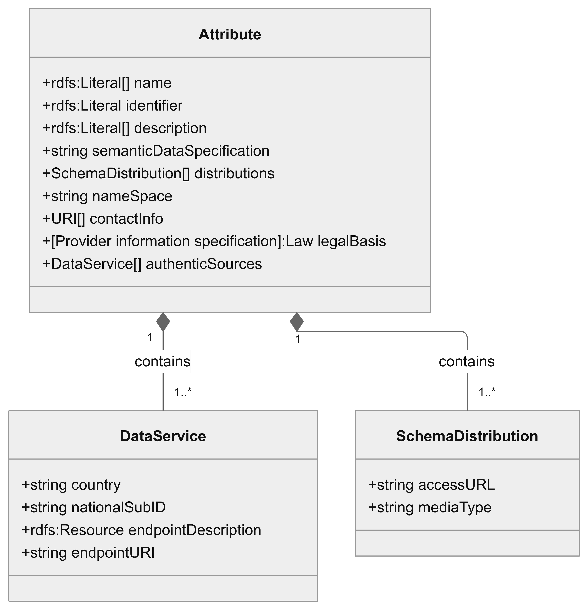
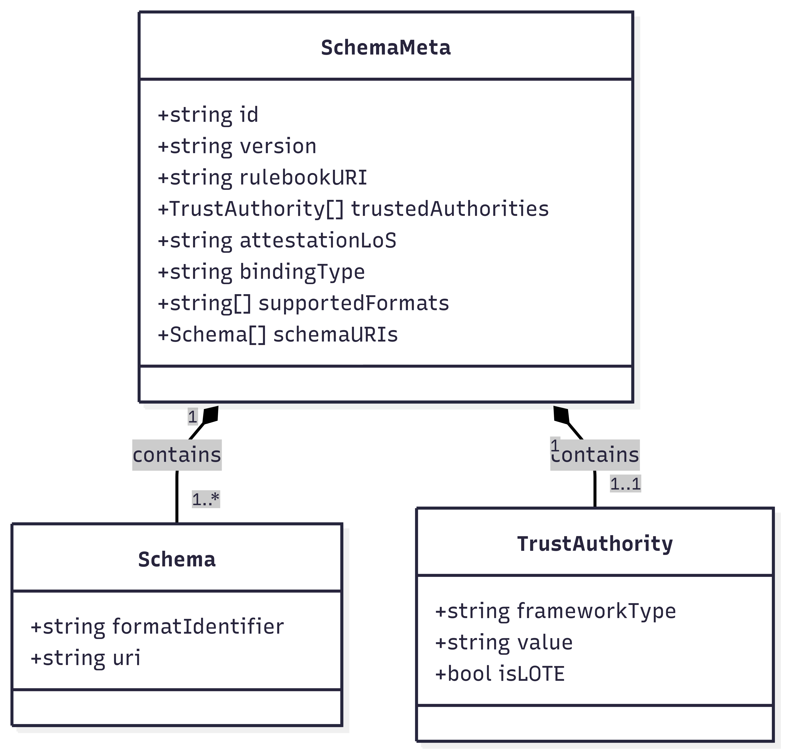

  

# Specification of interfaces and formats for the catalogue of attributes and the catalogue of attestations

## Abstract

The present document specifies the interfaces and formats of European Commission’s catalogue of attributes and catalogue of attestations required by the [European Digital Identity Regulation (EU 910/2014)](https://eur-lex.europa.eu/eli/reg/2014/910/oj/eng). Specification includes a data model for catalogue of attributes, guidance on Attestation Rulebooks, attestation type data models and applicable application programming interface (API) for management of machine-readable attestation schemas.

Management of attribute schemas for the core attributes listed in Appendix VI of the [European Digital Identity Regulation (EU 910/2014)](https://eur-lex.europa.eu/eli/reg/2014/910/oj/eng) is proposed to be handled through the European Commission's OOTS services and infrastructure. This specification defines the data model to be used, and refers to the OOTS Common Services eDelivery (which uses [ISO 15000-3:2022](https://www.iso.org/standard/83479.html) as the basis of implementation) and ETSI technical specification 119 478 regarding implementation of the verification (and retrieval) interfaces towards authentic sources in member states.

### [GitHub discussion](https://github.com/eu-digital-identity-wallet/eudi-doc-standards-and-technical-specifications/discussions/428)

## Versioning

| Version | Date       | Description                                                          |
|---------|------------|----------------------------------------------------------------------|
| `0.1`   | 05.09.2025 | Initial version for discussion in sync with topic O discussion paper |
| `0.2`   | 24.09.2025 | Updated version after first focus group meeting and feedback         |
| `0.3`   | 03.10.2025 | Updated version for the 2-week commenting period                     |
| `1.0`   | 10.11.2025 | Version 1.0 matched with stable draft of ETSI TS 119 478             |

## 1. Introduction and Overview

The present document specifies the interfaces and formats and the application programming interface (API) related to **Catalogues of Attributes and Catalogues of Attestations** according to [European Digital Identity Regulation (EU 910/2014)](~https://eur-lex.europa.eu/eli/reg/2014/910/oj/eng~) - herein [Regulation] and the Commission Implementing Regulation (CIR) [EU 2025/1569](~http://data.europa.eu/eli/reg_impl/2025/1569/oj~) of 29 July 2025 laying down rules for the application of Regulation (EU) No 910/2014 of the European Parliament and of the Council as regards qualified electronic attestations of attributes and electronic attestations of attributes provided by or on behalf of a public sector body responsible for an authentic source - herein [CIR for EAAs].

Catalogue of attributes and attestations are addressed in Article  45e of the [Regulation] and the [CIR for EAAs] lays down further details, which are in scope of present technical document:

(1) Member States shall ensure, within 24 months of the date of entry into force of the implementing acts referred to in Articles 5a(23) and 5c(6), that, **at least for the attributes listed in Annex VI, wherever those attributes rely on authentic sources within the public sector, measures are taken to allow qualified trust service providers of electronic attestations of attributes to verify those attributes by electronic means** at the request of the user, in accordance with Union or national law.

Specifically on [CIR for EAAs]:

In the articles, Article 7 states:
The Commission shall establish and publish a catalogue of attributes and set up a secure system to enable requests to include or modify attributes in the catalogue of attributes.

Particularly, with respect to the **catalogue of attributes** the following are defined:

**Article 7 paragraph 3**
Member States shall request the inclusion of attributes listed in Annex VI to Regulation (EU) No 910/2014 to the catalogue of attributes wherever those attributes rely on authentic sources for the purpose of the verification by qualified trust service providers.

**Article 7 paragraph 3**
In addition, Member States may request the inclusion of attributes not listed in Annex VI to the catalogue of attributes wherever those attributes rely on authentic sources within the public sector. Private entities that are considered to be a primary source of information or recognised as authentic in accordance with Union or national law, including administrative practice, may request the inclusion of attributes not listed in Annex VI to the catalogue of attributes wherever the requesting entity is responsible for those attributes.

For the purposes of defining the technical specification, the [CIR for EAAs] specifies regarding the catalogue of attributes to contain of:

1. At minimum the list of attributes that rely on Authentic Sources and metadata - Annex VI of the [Regulation]
2. Namespace, identifier, semantic description and data type for each attribute
3. Verification point for the attribute values at each Member State for the QTSPs

The attribute groups present in Annex VI of the [Regulation] are: Address; Age; Gender; Civil status; Family composition; Nationality or citizenship; Educational qualifications, titles and licences; Professional qualifications, titles and licences; Powers and mandates to represent natural or legal persons; Public permits and licences; For legal persons, financial and company data;

Regarding catalogues of attestations, the **Article 8** states:
The Commission shall establish and publish a catalogue of schemes for the attestation of attributes and set up a secure system to enable requests to include or modify schemes for the attestation of attributes in the catalogue of schemes for the attestation of attributes.

The [CIR for EAAs] specifies the catalogue of schemes for attestations of attributes as a list of attestation schemes and metadata to contain of (at minimum):

1. the name of the scheme
2. the name and contact information of the scheme for the attestation of attributes owner
3. the status and version of the scheme
4. a reference to specific laws, standards or guidelines, where the issuance,  validation, or use of an electronic attestation of attributes within the scope of the scheme is subject to them
5. the format or formats of electronic attestation of attributes within the scope of the scheme
6. one or more namespaces, attribute identifiers, semantic descriptions and data types of each attribute that is part of an electronic attestation of attributes within the scope of the scheme, either by reference to an attribute in the catalogue of attributes in Article 7, or an attribute defined in an analogue way within the scope of the scheme
7. a description of the trust model and the governance mechanisms applied under the scheme, including the revocation mechanisms
8. any requirements concerning the providers or the sources of information on which those providers rely when issuing electronic attestations of attributes
9. a statement whether electronic attestations of attributes within the scope of the scheme are to be issued as qualified electronic attestations of attributes, as electronic attestations of attributes issued by or on behalf of a public sector body responsible for an authentic source, or as both.

**The catalogues shall provide their information in both human- and machine-readable format** (first presumably via a web service, latter through a high-availability API). API and infrastructure serving data behind it shall meet the requirements for high availability and real-time scheme verification by Wallet Units and Verifiers.

> Note: This specification, as a technical specification, uses the term **"schema"** instead of "scheme" used in the regulatory texts, "schema" being the more correct one to be used for machine-readable data structures.

## 2. Data Model for the catalogue of attributes

The data model and common format for the catalogue of attributes is designed to be hosted by the [Single Digital Gateway](https://eur-lex.europa.eu/legal-content/EN/TXT/PDF/?uri=CELEX:32018R1724&from=EN) and [OOTS Semantic Repository](https://sr.dev.oots.tech.ec.europa.eu/) services of the European Commission, taking into account the requirements from the [Regulation] regarding the mandatory attribute elements to be registered.

As outlined in the figure below, the main class of the data model is **Attribute**, which

* contains the properties listed in [Section 2.1](#21-attribute)
* defines two **auxiliary classes**:
  * **DataService** (see [Section 2.1.1](#211-dataservice))
  * **SchemaDistribution** (see [Section 2.1.2](#212-schemadistribution))
  

### 2.1 Attribute

The `Attribute` main class contains a sub-classes `DataService` and `SchemaDistribution` and the properties specified in the following table - with mappings to matching Single Digital Gateway/OOTS and ETSI 119 478 data properties provided for convenience:

| Property name      | Multiplicity | Type  | Description | OOTS property mapping  | ETSI 119 478 property mapping  |
|--------------------|--------------|-------|-------------|---------------|-----------------------|
| `name`             | [1..*]       | *rdfs:Literal*      | array of language-tag -localised friendly names of the attribute. At least English-language (default) attribute name SHALL be provided. | sdg:DataServiceEvidenceType/sdg:Title  | dct:title|
| `identifier`       | [1..1]       | *rdfs:Literal*  | unique identifier assigned for the attribute within the catalogue of attributes, in form of a URI according to [RFC3986](https://datatracker.ietf.org/doc/html/rfc3986). This identifier shall contain the namespace, the local identifier and the version of the attribute as required in [CIR for EAAs] Article 7 5(d).  | sdg:DataServiceEvidenceType/sdg:EvidenceTypeClassification sr:Asset/sr:identifier | dct:identifier|
| `description`      | [1..*]       | *rdfs:Literal*  | array of human-friendly description of the attribute, which SHOULD be provided at least in English, and additional localisations MAY be provided with corresponding language tags appended to the description string. | sdg:DataServiceEvidenceType/sdg:Description | dcat:Description |
| `semanticDataSpecification`    | [0..1]  | *string*  | optional URI according to IETF RFC 3986 pointing to semantic data specification of the attribute (evidence type in OOTS terminology) in the [OOTS Semantic Repository](https://sr.dev.oots.tech.ec.europa.eu/). Semantic data specification references a structured, standardised, and media type-agnostic definition describing the attribute’s data elements, semantics, and relationships. | URI pattern base: `https://sr.oots.tech.ec.europa.eu/datamodels/`   |             |
| `distributions`    | [1..*]  | Array of [*SchemaDistribution*](#212-schemadistribution) objects | array of `SchemaDistribution` objects that contain the URL pointing to each schema distribution's access URL, and its media type.  **Note:** May appear multiple times if multiple distributions are defined in semantic data specification of the attribute. See details in [**SchemaDistribution**](#212-schemadistribution) auxiliary class.|  | dcat:distribution |
| `nameSpace`        | [0..1]       | *string*               | optional URI assigned for the attribute's exact namespace (if not the one pointed at by namespace element in `identifier`, which can be a local SDG namespace) it conforms to, according to [RFC3986](https://datatracker.ietf.org/doc/html/rfc3986).  See also `identifier` above.     | sr:Assetsr:conformsTo | dct:conformsTo |
| `contactInfo`      | [1..*]       | *string* | array of URIs that provide the contact information of the entity which requested to include the attribute in the catalogue of attributes. If only single contact element is provided, the URI SHALL contain either an email address of the entity's responsible contact point in form of a smtp:// address, or a https:// URL to a web page with contact details of the entity. | sr:Asset/sr:publisher /sr:Agent/sr:name sr:Asset/sr:creator/sr:Agent/sr:name | dcat:contactPoint |
| `legalBasis`       | [0..*]    | *[Provider information specification]:Law*     | property allows provisioning of information with respect to the EU or national level law that acts as the legal basis of the attribute. Value SHOULD be an [ELI](https://eur-lex.europa.eu/EN/legal-content/summary/european-legislation-identifier-eli.html) URI pointing to the EU or national regulation text when such is available online. See [Provider information specification](https://github.com/eu-digital-identity-wallet/eudi-doc-standards-and-technical-specifications/blob/main/docs/technical-specifications/ts2-notification-publication-provider-information.md).   | sdg:DataServiceEvidenceType /sdg:AccessService sdg:Publisher/sdg:Jurisdiction | legalBasis |
| `authenticSources` | [1..*]       | Array of [*DataService*](#211-dataservice) objects | array of `DataService` objects. Each Member State providing the attribute through an authentic source(s) shall register their national evidence/attribute verification services. The object contains both the Member State national identifier and the endpoint as an URI - see details in [**DataService**](#211-dataservice) auxiliary class. | sdg:DataServiceEvidenceType/sdg:AccessService | dcat:DataService |

#### 2.1.1 DataService

The `DataService` sub-class is used within the definition of the [`Attribute`](#21-attribute) class to provide the **Member State identifier**, **data source identifier** and **verification endpoint** triple in the `authenticSources` array. The codes and strings shall be provided according to the rules set in Annex E of [ETSI TS 119 612] and national codification schemes. Access control and authorisation for the verification endpoint with a REST API is specified in Section 5.4 of [ETSI TS 119 478](https://github.com/eu-digital-identity-wallet/eudi-doc-standards-and-technical-specifications/issues/26), Single Digital Gateway (SDG) access policies and configurations for eDelivery based service integrations are described in chapter 4, section 4.7 of the [OOTS Technical Design Documents](https://www.google.com/url?q=https://ec.europa.eu/digital-building-blocks/sites/spaces/TDD/pages/605325079/OOTS%2BTechnical%2BDesign%2BDocuments%2BReleases&source=gmail-imap&ust=1759247967000000&usg=AOvVaw1sf_-SGE17E_RSymm5-9KY) (TDDs).

| Attribute     | Multiplicity | Type       | Description  | OOTS property mapping | ETSI 119 478 property mapping |
|---------------|--------------|------------|--------------|---------------|-----------------------|
| `country`     | [1..1]       | *string* | specifies the member state through a country code. | sdg:DataServiceEvidenceType/sdg:AccessService /sdg:Publisher/sdg:Jurisdiction/sdg:AdminUnitLevel1 | country |
| `nationalSubID`| [0..1]       | *string* | optional identifier, that narrows down a respective authentic source in the member state defined in `country` attribute. SHALL be codified through a national coding scheme. Only necessary in member states with multiple authentic sources for the single attribute.   | sdg:DataServiceEvidenceType/sdg:AccessService /sdg:Publisher/sdg:Identifier  | Not available  |
| `endpointDescription`        | [1..1]       | *rdfs:[Resource](https://semiceu.github.io/DCAT-AP/releases/3.0.0/#Resource)* | a description of the services available via the endpoint. The property gives specific details of the actual endpoint instances, while the property application profile (sdg:conformsTo or dct:conformsTo) is used to indicate the general standard or specification that the endpoint implements. | *To be added to DSD*  |  dcat:endpointDescription |
| `endpointURL`         | [1..1]       | *string* | URI of the root location or primary endpoint of the service (an IRI) for either verifying or retrieving data from the service. The URI format used depends on the integration service type, and SHALL be a party identifier for  eDelivery based services, or a direct server API endpoint for REST API based services as defined in  section 6.1 of [ETSI 119 478](https://github.com/eu-digital-identity-wallet/eudi-doc-standards-and-technical-specifications/issues/26). ***Note**: Other service types MAY be specified by the service providers.*  | sdg:DataServiceEvidenceType /sdg:AccessService/sdg:Identifier | dcat:endpointURL |

#### 2.1.2 SchemaDistribution

The `SchemaDistribution` sub-class is used within the definition of the [`Attribute`](#21-attribute) class to provide the **access URL** and **media type** tuple in the `distributions` array.

| Attribute     | Multiplicity | Type       | Description  | OOTS property mapping | ETSI 119 478 property mapping |
|---------------|--------------|------------|--------------|---------------|-----------------------|
| `accessURL`     | [1..1]       | *string* | is the URL which gives access to the schema distribution. See also section 6.8.9 of [W3C DCAT]. |  | dcat:accessURL |
| `mediaType`| [1..1]       | *string* | is the media type of the data model schema. See also section 6.8.16 of [W3C DCAT]. According to Article 2 (3) of [CIR for EAAs] the catalogue of attributes SHALL contain at least a JSON schema of the attribute, the corresponding media type value is `application/json-schema`. Examples of possible schema media types are defined in section 5.2.2 of [ETSI TS 119 478](https://github.com/eu-digital-identity-wallet/eudi-doc-standards-and-technical-specifications/issues/26).    |   | dcat:mediaType  |

## 3. Interfaces for the catalogue of attributes and authentic source verification

The discover interface for the catalogue of attributes is specified in full in section 5 of [ETSI TS 119 478](https://github.com/eu-digital-identity-wallet/eudi-doc-standards-and-technical-specifications/issues/26), and is only briefly described in Section [3.1](#31-discovery-service-interface) below.

The [OOTS Common Services](https://ec.europa.eu/digital-building-blocks/sites/spaces/TDD/pages/909707674/Chapter+3+Common+Services+v1.2.2+July+2025) offer public-access search functions for discovery of registered attributes (hosted and managed in the [Semantic Repository](https://sr.dev.oots.tech.ec.europa.eu/)), offering access to EvidenceTypes (mapped to attestation type or attribute in the EUDI Wallet ecosystem terminology) and Data Services serving given EvidenceType related verification service for the Member States and their public sector entities.

### 3.1 Discovery Service interface

The interface to be used for discovery of verification services for attributes in different member states are specified under the 'I1' interface in [ETSI TS 119 478](https://github.com/eu-digital-identity-wallet/eudi-doc-standards-and-technical-specifications/issues/26) section 5.1.

The HTTP based interface specification relates to and aims to be interoperable with the Data Service Directory (DSD) and Semantic Repository (SR) operated by the European Commission under the Once-Only-Technical System (OOTS).

### 3.2 Authentic Source Interface

Two alternative technical interfaces are specified in [ETSI TS 119 478](https://github.com/eu-digital-identity-wallet/eudi-doc-standards-and-technical-specifications/issues/26) section 6 for use by the QTSPs as the catalogue of attributes Authentic Source verification service. The other one is based on the Single Digital Gateway infrastructure of the EU, the other one provides an alternative with a direct RESTful Application Programming Interface design pattern.

Other integration types can be specified with help of the extensible 'DataService' information data model, if this is required by the national verification service implementations.

#### 3.2.1 Verify interface based on ISO 15000

Section 6.2 of the [ETSI TS 119 478] specifies a verification service interface option compatible with how the OOTS Common Services provide the QTSPs and other actors the option to integrate onto the [eDelivery Building Block](https://ec.europa.eu/digital-building-blocks/sites/spaces/TDD/pages/909707682/1.+Once-Only+Technical+System+High+Level+Architecture+v1.2.2+July+2025#id-1.OnceOnlyTechnicalSystemHighLevelArchitecturev1.2.2(July2025)-7.4.eDelivery) for executing actual attribute verification service against a discovered member state verification endpoint.

#### 3.2.2 Verify interface based on HTTP and OAuth 2.0 APIs

Section 6.1 of the [ETSI TS 119 478] specifies a verification service interface option through use of two [OpenAPI](~https://spec.openapis.org/oas/latest.html~) compatible APIs and [OAuth 2.0 dynamic client registration profile (RFC 7591)](https://www.rfc-editor.org/info/rfc7591) authorisation based mechanism for the authentic source verification and retrieval requests by the QTSPs.

## 4. Catalogue of attestations

### 4.1 Requirements

In the EUDIW ecosystem providers of QEAAs and PUB-EAAs SHOULD register their attestations into the European Commission’s Catalogue of Attestations. For non-qualified EAA providers the registration of an Attestation Rulebook and the accompanied attestation schema is optional, but it is RECOMMENDED that EAA providers register their attestations to the catalogue of attestations.

Information in the combination of an Attestation Rulebook and the attestation schema registered in catalogue of attestations SHALL contain for the QEAAs and Pub_EAAs (and for EAAs, when applicable), according to [CIR for EAAs] the following:

* name;
* status;
* version;
* contact information;
* references to laws and standards applying to the scheme;
* guidelines for the issuance, validation and use of an attestation (e.g. issuance as device-bound or not);
* format(s) of the attestation;
* namespaces, attribute identifiers, semantic descriptions and data types of each attribute;
* attribute definitions or pointer(s) to the catalogue of attributes (Ed note: URI to Semantic Repository)
* applicable trust model, requirements for attestation providers or data sources, and
* type of attestation (Qualified, Pub_EAA or EAA) (Ed note: PID is not strictly speaking an attestation, left out intentionally)

### 4.2. Human-readable format - Attestation Rulebook

The governance model and rules of an individual attestation of attributes SHALL be documented into its corresponding, publicly accessible Attestation Rulebook.

The location of the European Commission -managed, open catalog for Attestation Rulebooks is the [Attestation Rulebooks Catalog repository](https://github.com/eu-digital-identity-wallet/eudi-doc-attestation-rulebooks-catalog). All QEAA and Pub_EAA Attestation Rulebooks SHALL be published in this catalog along with their attestation schemas, and registration of Attestation Rulebooks into this catalog is recommended for EAA providers.

URL to the published Rulebooks in the Attestation Rulebooks Catalog is [https://github.com/eu-digital-identity-wallet/eudi-doc-attestation-rulebooks-catalog/tree/main/rulebooks](https://github.com/eu-digital-identity-wallet/eudi-doc-attestation-rulebooks-catalog/tree/main/rulebooks).

#### 4.2.1 Rulebook template

The Attestation Rulebooks Catalog repository offers a generic [rulebook template](https://github.com/eu-digital-identity-wallet/eudi-doc-attestation-rulebooks-catalog/tree/main/template) for creation of Rulebooks.

### 4.3 Machine-readable data models and formats - attestation schemas

#### 4.3.1 SchemaMeta main class

This is a common attestation schema data model, with specified sub-classes `Schema` for handling the schemas for different attestation types, and `TrustAuthority` for handling the information required for resolving the trust framework related to the attestation type.

| Attribute | Multiplicity | Type       | Description   |
|-----------|--------------|------------|---------------|
| `id`      | [1..1]       | *string*   | unique identifier (UUID) of the schema, provided by the server of the catalogue provider        |
| `version` | [1..1]       | *string* | version of the schema following SemVer practices  |
| `rulebookURI` | [1..1]   | *string* | URI to the human-readable Attestation Rulebook that SHALL define all non-machine readable aspects of the attestation type defined. The URI MAY be suffixed with #integrity, the value of which SHALL be an "integrity metadata" string as defined in Section 3 of [W3C SRI](https://www.w3.org/TR/sri/). If present, the integrity of Attestation Rulebook document SHALL be verified by the URI consumer as defined in Section 3.3.5 of [W3C SRI](https://www.w3.org/TR/sri/).                |
| `trustedAuthorities` | [0..*]   | Array of `TrustAuthority` objects | optional array of objects that resolve to the applicable trust management scheme(s) (trust model) or trust anchor(s) to be used according to the options available in [OpenID4VP Section 6.1.1](https://openid.net/specs/openid-4-verifiable-presentations-1_0-27.html#section-6.1.1). Current alternatives available via OpenID4VP are X.509 Authority Key Identifier (see Section 4.2.1.1 of [RFC5280](https://doi.org/10.17487/RFC5280)), ETSI Trusted Lists or OpenID Federation. The trust model with providers of QEAAs, Pub-EAAs and PIDs is based on European Commission -managed Lists of Trusted Lists ([ETSI TS 119 612](https://github.com/eu-digital-identity-wallet/eudi-doc-standards-and-technical-specifications/issues/41)), whereas **for non-qualified EAAs the technical specification on List of trusted entities (LoTE) data model ([ETSI TS 119 602](https://github.com/eu-digital-identity-wallet/eudi-doc-standards-and-technical-specifications/issues/278)) is recommended for use, i.e. MAY be used by EAA providers.** Note: OpenID Federation MAY only be used in context of non-qualified EAA types. The `trustedAuthorities` attribute is optional only for attestations that don't belong under any kind of trust model, i.e. for "self-signed" attestations.   |
| `attestationLoS` |    [1..1]       | *string* | level of security (LoS) the attestation is to be provided at. Issuance process for registered LoS SHALL follow minimum requirements set in the [OpenID4VCI] Annex [D.2](https://openid.net/specs/openid-4-verifiable-credential-issuance-1_0-17.html#appendix-D.2). Allowed value is a string from the set of: `iso_18045_high`, `iso_18045_moderate`, `iso_18045_enhanced-basic` or `iso_18045_basic`. |
| `bindingType` |  [1..1]       | *string* | indicates the type of cryptographic key binding required for issuance of the attestation, with four categories: binding to a cryptographic claim presented by the User ('claim'), binding to a key possessed by the User ('key'), binding to presented biometrics of the User ('biometric') or no cryptograhpich binding ('none'). Allowed value is a string from the set of: `claim`, `key`, `biometric` or `none`.   |
| `supportedFormats` | [1..*]       | *array of strings* | array of formats available for the attestation type. Possible string values are `dc+sd-jwt`, `mso_mdoc`, `jwt_vc_json`, `jwt_vc_json-ld` and `ldp_vc`.  |
| `schemaURIs` | [1..*]       | *array of `Schema` objects* | array of persistent and unique, format specific schema URIs bound to each supported format via a `Schema` object.  |

> Note: Separate from the attestation-specific `attestationLoS` indicator, the Attestation Rulebook template has meta-information placeholder to indicate if provisioning the attestation of attributes requires prior authentication of the User with a particular eID means (such as e.g. a PID).

#### 4.3.2 Schema sub-class

Sub-class `Schema` is an object tuple containing the enumerated format identifier of the schema type, and the designated URI for accessing the JSON schema via the Internet.

| Attribute | Multiplicity | Type       | Description   |
|-----------|--------------|------------|---------------|
| `formatIdentifier` | [1..1]       | *string* | string from the set of: `dc+sd-jwt`, `mso_mdoc`, `jwt_vc_json`, `jwt_vc_json-ld` or `ldp_vc`  |
| `uri` | [1..1]       | *string* | persistent schema URI assigned for each registered format of the attestation type. The URI is provided to the registering entity by the catalogue provider as part of completed registration. The `uri` value MAY be suffixed with #integrity, the value of which SHALL be an "integrity metadata" string as defined in Section 3 of [W3C SRI](https://www.w3.org/TR/sri/). If present, the integrity of the attestation schema URI SHALL be verified by the URI consumer as defined in Section 3.3.5 of [W3C SRI](https://www.w3.org/TR/sri/).   |

#### 4.3.3 TrustAuthority sub-class

Sub-class `TrustAuthority` is an object triple with enumerated type of applicable trust framework and the identifier value and sub-qualifier, necessary for resolving the trust framework related to the attestation type.

| Attribute | Multiplicity | Type       | Description   |
|-----------|--------------|------------|---------------|
| `frameworkType` | [1..1]       | *string* | type of the applicable trust model/framework. A string from the set of: `aki`, `etsi_tl` or `openid_federation`.  |
| `value` | [1..1]       | *string* | base64url (for authorised key identifier (`aki`) of X.509 certificate) or a standard URI-formatted identifier for the Trusted List (for type `etsi_tl`) or Entity Identifier (for type `openid_federation`)  |
| `isLoTE` | [0..1] | *boolean* | a boolean value that SHALL be TRUE when the applicable trust framework type is an ETSI Trusted List (`etsi_tl`) but the trusted list behind the `value` URI is a list of trusted entities (LoTE) according to ETSI TS 119 602. Value SHALL be FALSE if the applicable trusted list specification is ETSI TS 119 612. Attribute SHALL NOT be used with the two other framework types. |

> Note: Use of `isLoTE` will become unnecessary and shall be deprecated once OpenID4VCI specifies a new enumeration for Lists of Trusted Entities according to ETSI TS 119 602, the tentative enumeration is `etsi_lote`.

Figure 1. Catalogue of attestations data classes

#### 4.3.4 Format-specific data schemas

The attestation schema(s) provided via the Catalogue of attestations API SHALL be provided as appendixes of the Attestation Rulebook by the registering entity upon registration.

The schemas SHALL be provided in JSON format, and SHALL follow the following format:

| Issuance format   | Format identifier   | Schema type  |
|-------------------|---------------------|--------------|
| SD-JWT VC         | `dc+sd-jwt`           |  Verifiable Credential Type (VCT) as specified in [OpenID4VCI](https://github.com/eu-digital-identity-wallet/eudi-doc-standards-and-technical-specifications/issues/3) SHALL be used.   |
| ISO mDoc          | `mso_mdoc`            |  DocumentType (DocType) format as specified in [ISO 23220-2](https://www.iso.org/standard/86782.html) SHALL be used.    |
| W3C Verifiable Credentials | `jwt_vc_json`, `jwt_vc_json-ld` or `ldp_vc` | [OpenID4VCI](https://github.com/eu-digital-identity-wallet/eudi-doc-standards-and-technical-specifications/issues/3) lists three possible credential formats with [W3C Verifiable Credential](https://www.w3.org/TR/2022/REC-vc-data-model-20220303/) specifications - OpenID4VCI [Appendix A.1](https://openid.net/specs/openid-4-verifiable-credential-issuance-1_0-15.html#name-w3c-verifiable-credentials) describes the options that SHALL be used for each possible type. |

Note that if several attestation formats are supported, the registering entity SHALL provide all schemas upon registration. Example schema templates are provided in the [Attestation Rulebooks Catalog](https://github.com/eu-digital-identity-wallet/eudi-doc-attestation-rulebooks-catalog).

The online access and management of schemas, published for open access via the URLs listed in `SchemaMeta.SchemaURIs` object after publication, is done via the Catalogue of attestations API.

### 4.4 Attestation schemas information summary

Mapping of the required information elements from Section [4.1](#41-requirements) as split between the human-readable Attestation Rulebook and machine-readable schema is presented in following table, with applicable rulebook template section and attestation schema class identifiers in `parent.child` format for each element:

| Information element   | Attestation Rulebook (human-readable)  | Schema definition (machine-readable)  |
|-----------------------|----------------------------------------|-------------------------|
| name | 1st page - Attestation Type in title  | `SchemaMeta.Schema.uri`, (format specific) display metadata  |
| status | 1st page - version table | *Not available*  |
| version | 1st page - version table | `SchemaMeta.version` |
| contact | 1st page - contact or feedback link  |  `rulebookURI` |
| law/standard | Chapter 7 Compliance| *Not available*  |
| issuance rules | Chapter 3 Attestation encoding, Chapter 4 Attestation usage | `SchemaMeta.attestationLoS`, `SchemaMeta.bindingType`  |
| attestation formats | Chapter 3 Attestation encoding |  `SchemaMeta.supportedFormats` |
| attribute namespaces  | Chapter 3 Attestation encoding |  `SchemaMeta.Schema.uri`, format specific attribute/claim definitions   |
| attribute definition| Chapter 2 Attestation attributes and metadata |  `SchemaMeta.Schema.uri` |
| trust model | Chapter 5 Trust anchors |  `SchemaMeta.TrustAuthority` |
| Legal EUDIW attestation type | Chapter 2.1 |  `SchemaMeta.TrustAuthority`   |

### 4.5 Registration and governance of Attestation Rulebooks and attestation schemas

The European Commission's registration and governance (maintenance) process for catalogued Attestation Rulebooks and related requirements, and a rulebook template for documenting of individual Attestation Rulebooks and their attestation schema is published at the [Attestation Rulebooks Catalog repository](https://github.com/eu-digital-identity-wallet/eudi-doc-attestation-rulebooks-catalog). This section specifies practices to be used within this catalog, which SHALL be used by QEAA and Pub_EAA providers, and MAY be used by non-qualified EAA providers in the EUDI ecosystem.

#### 4.5.1 Versioning

A new, approved catalogued Attestation Rulebook and its attestation schema SHALL be published by the European Commission with version number 1.0. Lifecycle management of published Attestation Catalogues SHALL utilise [semantic versioning (SemVer)](https://semver.org/) in version numbering.

#### 4.5.2 Maintenance

The management and versioning of published Attestation Rulebooks and attestation schemas SHALL be executed through a versioning system for Attestation Rulebooks in human-readable format, and through the [Catalogue of attestations Application Programming Interface](~#5-application-programming-interface~) for machine-readable attestation schemas.

#### 4.5.3 Authorisation

Operations SHALL be authorised only for the entity (its authorised representatives) that has registered the attestation schema and the accompanying Attestation Rulebook.

> Note: A more complete governance description is work in progress, using the draft CD of ISO 23220-7 as the baseline for building a managed registering authority for attestation catalogues. the ISO specification aims at covering the globally recognised mdoc document types, and can well be used as a reference in this specification when approved as International Standard in the ISO.

## 5. Application Programming Interface for management of machine-readable attestation schemas

### 5.1 Summary

This technical specification defines an Open API compatible application programming interface (API) for managing attestation schemas with the following methods:

GET /schemas: Lists all attestation schemas with filtering and pagination.

PUT /schemas/{schemaId}: Updates a specific attestation schema.

DELETE /schemas/{schemaId}: Deletes a specific attestation schema.

 > Note: Any online attestation schema management tools integrated with the API should arrange their user flows according to the method capabilities (e.g. note that the schema management beyond queries basically requires the full attestation schema element for the method calls, not individual attributes). Authorisation mechanism required for the API's PUT or DELETE methods will be defined by the European Commission into section 5.2.2 in future version of this specification.

### 5.2 Requirements

#### 5.2.1. Query access

The Catalogue of attestations API read methods SHALL be open for public access. The public API SHALL provide methods for downloading complete attestation schemas matching with provided query parameters helping in discovery and validation of registered attestation schemas.  

#### 5.2.2 Write or delete access

Access to management of attestation schemas through PUT or DELETE methods SHALL be available only for authorised and authenticated representatives of the registering entity.

#### 5.2.3 Delivery of schema URIs

The permanent attestation schema URI SHALL be provided to the registering entity's contact person upon successful registration, and is thereafter referable in Wallet-relying Party registrations irrespective of the role (entitlement) of the registering entity, and consequently for attestation schema validation by Wallet Units and Wallet-Relying Parties.

### 5.3 API method descriptions

#### 5.3.1 GET methods

paths:

`/schemas` (GET):

There is a  **GET** /schemas endpoint for making parametrised queries. For this purpose, the API specification has the `parameters` section, where:

* Each filterable field (`id`, `supportedformat`, `attestationlos`, `bindingtype`, `trustedAuthoritiesFrameworkType`, `trustedAuthoritiesValue` `schemauri`, `rulebookuri`) is defined as a query parameter.
* `in: query`: Specifies that the parameter is a query parameter.
* `name`: The name of the query parameter.
* `schema`: Defines the data type of the query parameter.
* `description`: Provides a brief explanation of what the query parameter filters by.

Where query results match at least one attestation schema, the JWS-signed method response SHALL provide:

* the full contents of `SchemaMeta` class for matching instance in JSON format.

If no query parameters are included, the method returns the full list of registered attestation schemas in the catalog.

The JWS-signed response body for a successful GET `(200)` will be a paginated list of matching `SchemaMeta` objects.

 `/schemas/{schemaId}` (GET):

There is a separate  /schemas/{schemaId} endpoint for requesting single SchemaMeta contents with a **GET** method, based on attestation schema's provisioned unique identifier `Id`, with the following `parameters` section:

* `in: path`: Specifies that the parameter is a path parameter.
* `name: schemaId` The unique identifier of attestation schema as the path name.

The JWS-signed response body for a successful GET `(200)` will be a `Id`-value matching `SchemaMeta` object's contents in JSON format.

#### 5.3.2 PUT methods

paths:

 `/schemas/{schemaId}` (PUT):

The /schemas/{schemaId} endpoint allows use of **PUT** for updating the completed SchemaMeta contents based on attestation schema's provisioned unique identifier `Id`.

The JWS-signed response body for a successful PUT `(200)` will be the updated `SchemaMeta` object's contents in JSON format.

#### 5.3.3 DELETE methods

paths:

 `/schemas/{schemaId}` (DELETE):

The /schemas/{schemaId} endpoint allows use of **DELETE** for deleting an attestation schema based on its unique identifier `Id`.

The response for a successful DELETE operation is `(204)`, `(404)` if an attestation schema with specified unique identifier was not found.

#### 5.3.4 OpenAPI specification

The OpenAPI 3.1 compatible REST API methods for the above are provided in [Annex A.3](#a3-openapi-specification-for-catalogue-of-attestations-api-normative).

### 5.4 Protection against DDOS attacks and accidental overuse of the GET methods

The API implementation SHALL take into consideration the vulnerabilities that an open, comprehensive query interface enables for both malicious or non-malicious users of the interface. First well-known vulnerability is sensitivity for Distributed Denial-of-Service (DDoS) attacks, the other valid one especially for the GET/schema endpoint is the server load that very complex query parameter combinations from badly planned or non-intended/accidental misuse of the query mechanism can cause at the catalog's server-side solution.

### 5.5 DDoS attack protection guidelines

Following policy/recommendation SHOULD be implemented (with solution-fitted combinations) in the Catalog of attestations API implementations to protect the API from DDoS attacks:

* Use of ****a Cloud-based DDoS Protection Service/CDN**** as the best first line of defense for volumetric attacks.
* Use of an ****API Gateway or Load Balancer with Rate Limiting**** is crucial for fight against application-layer attacks targeting the API.
* Deploy a ****Web Application Firewall (WAF)**** to protect against other application-layer threats and to complement rate limiting.
* Ensure your infrastructure is scalable by using e.g. ****Load Balancers**** to handle legitimate bursts and some attack traffic.
* Utilise ****Caching**** heavily for the GET endpoints to reduce backend load - many responses might be static or change infrequently, and caching the responses at the CDN, load balancer or application level means the API logic and database will receive less requests.
* Have robust ****API monitoring**** for request rates, latency, error rates, server resource utilisation and source IP addresses with proper alerting in place.
* Utilise ****network segmentation**** - e.g., isolate the API servers in a private subnet behind the WAF, and from the actual catalog database to improve robustness of your network architecture against hostile attacks.

### 5.6 Protection against unintentional misuse

The implementers SHOULD consider how to limit the load of the API from perfectly legal but unintentionally complex or frequent API calls to the query endpoints. Possible solutions for this are:

* The GET endpoints SHOULD be provided with e.g. rate limiter for calls coming in from an individual IP address.

The European Commission SHALL publish in their respective API documentation what limits it has configured regarding rate limits for legal use, or use of the query parameters. E.g., it could be that the API allows only 3 calls per minute from each IP address, and/or queries with total of 4 parameters (both values are examples - actual limits must be tested during the API implementation and test phases).

### 6 References

| Reference                    | Description        |
|------------------------------|--------------------|
| [Regulation]                 | [European Digital Identity Regulation (EU 910/2014)](https://eur-lex.europa.eu/eli/reg/2014/910/oj/eng) |
| [CIR for EAAs]               | [Commission Implementing Regulation \(EU\) 2025/1569 of 29 July 2025 laying down rules for the application of Regulation \(EU\) No 910/2014 of the European Parliament and of the Council as regards qualified electronic attestations of attributes and electronic attestations of attributes provided by or on behalf of a public sector body responsible for an authentic source](http://data.europa.eu/eli/reg_impl/2025/1569/oj) |
| [CIR for eID assurance levels] | [Commission Implementing Regulation (EU) 2015/1502 of 8 September 2015 on setting out minimum technical specifications and procedures for assurance levels for electronic identification means pursuant to Article 8(3) of Regulation (EU) No 910/2014 of the European Parliament and of the Council on electronic identification and trust services for electronic transactions in the internal market](https://eur-lex.europa.eu/eli/reg_impl/2015/1502/oj)  |
| [OOTS Common Services]       |    [OOTS Technical Design Documents - Common Services](https://ec.europa.eu/digital-building-blocks/sites/spaces/TDD/pages/909707674/Chapter+3+Common+Services+v1.2.3+September+2025)                   |
|  [OOTS Technical Design Documents] | [OOTS Technical Design Documents](https://ec.europa.eu/digital-building-blocks/sites/spaces/TDD/pages/920061672/OOTS+Technical+Design+Documents+v1.2.3+September+2025) |
| [Specification of common formats and API for relying-party registration information] | [The European Commission Specification of common formats and API for Relying Party Registration information](https://github.com/eu-digital-identity-wallet/eudi-doc-standards-and-technical-specifications/blob/main/docs/technical-specifications/ts7-common-interface-for-data-deletion-request.md) |
| [Provider information specification]   | [The European Commission Technical Specification of systems enabling the notification and subsequent publication of Provider information](https://github.com/eu-digital-identity-wallet/eudi-doc-standards-and-technical-specifications/blob/main/docs/technical-specifications/ts2-notification-publication-provider-information.md) |
| [ELI] | [European Legislation Identifier (ELI)](https://eur-lex.europa.eu/EN/legal-content/summary/european-legislation-identifier-eli.html)  |
| [ETSI TS 119 478]                                 | [ETSI TS 119 478 V0.0.7 Electronic Signatures and Trust Infrastructures (ESI); Specification of interfaces related to Authentic Sources](https://github.com/eu-digital-identity-wallet/eudi-doc-standards-and-technical-specifications/issues/26) (draft) |
| [ETSI TS 119 612]                                 | [ETSI TS 119 612 V2.3.1 Electronic Signatures and Trust Infrastructure (ESI); Trusted Lists](https://github.com/eu-digital-identity-wallet/eudi-doc-standards-and-technical-specifications/issues/41) |
| [ETSI TS 119 602]                                 | [ETSI TS 119 602 V0.0.1 Electronic Signatures and Trust Infrastructure (ESI); List of trusted entities; Data model](https://github.com/eu-digital-identity-wallet/eudi-doc-standards-and-technical-specifications/issues/278) (draft) |
| [OpenID4VCI]    |   [OpenID for Verifiable Credential Issuance 1.0](https://github.com/eu-digital-identity-wallet/eudi-doc-standards-and-technical-specifications/issues/3)           |
| [OpenID4VP]     |  [OpenID for Verifiable Credential Presentation 1.0](https://github.com/eu-digital-identity-wallet/eudi-doc-standards-and-technical-specifications/issues/2) |
| [ISO 15000-3]| [ISO/IEC 15000-3:2023 Electronic business eXtensible Markup Language (ebXML) Part 3: Registry and repository](https://github.com/eu-digital-identity-wallet/eudi-doc-standards-and-technical-specifications/issues/457)  |
| [ISO 23220-2]   |   [ISO/IEC TS 23220-2:2024 - Cards and security devices for personal identification — Building blocks for identity management via mobile devices, Part 2: Data objects and encoding rules for generic eID systems](https://github.com/eu-digital-identity-wallet/eudi-doc-standards-and-technical-specifications/issues/388)                          |
| [ISO 23220-7]   |   [ISO/IEC AWI 23220-7 - Cards and security devices for personal identification — Building blocks for identity management via mobile devices, Part 7: Registration Authority Procedures for Mobile Document](https://github.com/eu-digital-identity-wallet/eudi-doc-standards-and-technical-specifications/issues/453) (draft)                  |
|  [ISO 18045]   |    [ISO/IEC 18045:2022 Information security, cybersecurity and privacy protection — Evaluation criteria for IT security — Methodology for IT security evaluation](https://github.com/eu-digital-identity-wallet/eudi-doc-standards-and-technical-specifications/issues/92)  |
| [RFC 5280]  | [Internet X.509 Public Key Infrastructure Certificate and Certificate Revocation List (CRL) Profile](https://github.com/eu-digital-identity-wallet/eudi-doc-standards-and-technical-specifications/issues/77) |
|  [RFC 3986]    |    [Uniform Resource Identifier (URI): Generic Syntax](https://datatracker.ietf.org/doc/html/rfc3986)        |
| [W3C DCAT]     |    [W3C Data Catalog Vocabulary (DCAT) – Version 3](https://www.w3.org/TR/vocab-dcat-3/) |
| [W3C SRI]      |    [W3C Subresource Integrity](https://www.w3.org/TR/sri/) (draft) |

## Annex A

> Note: Catalogue of attributes may end up having a RDF schema if hosted in DCAT/SDG based system

### A.1 JSON Schema for attributes in catalogue of attributes (normative)

The file [`ts11-json-cat-of-attributes-datamodel`](api/ts11-cat-of-attributes-datamodel.json) contains the JSON schema for the catalogue of attributes data model.

### A.2 JSON Schema for catalogue of attestations data model (normative)

The file [`ts11-json-cat-attestations-data-model`](api/ts11-json-cat-attestations-data-model.json) contains the JSON schema for the catalogue of attestations data model.

### A.3 OpenAPI Specification for catalogue of attestations API (normative)

The file [`ts11-cat-of-attestations-openapi`](api/ts11-cat-of-attestations-jwt-openapi31.yml) contains the [OpenAPI](https://spec.openapis.org/oas/latest.html) specification of the JSON and REST based application programming interface methods described in [Section 5](#5-application-programming-interface-for-management-of-machine-readable-attestation-schemas).

### A.4 XML Schemas (informative)

The file [`ts11-xds-cat-of-attributes-datamodel`](api/ts11-cat-of-attributes-datamodel.xds) contains the XML schema for the catalogue of attributes data model.

The file [`ts11-xds-cat-attestations-data-model`](api/ts11-xds-cat-attestations-data-model.xds) contains the XML schema for the catalogue of attestations data model.
