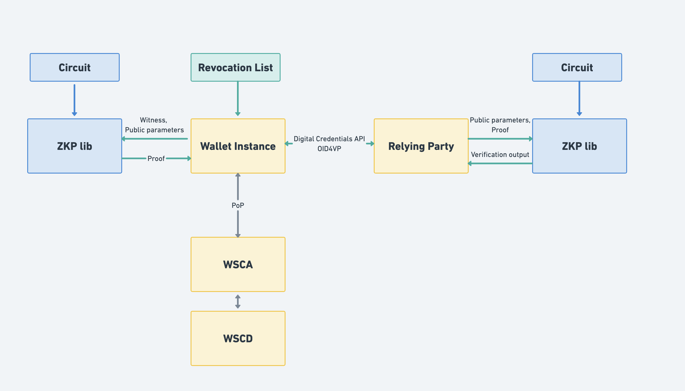

<br/>

# Specification for the implementation of Zero-Knowledge Proofs based on arithmetic circuits in the EUDI Wallet

## Note

This technical specification captures exploratory work aimed at clarifying the technical considerations and outlining a possible approach, which will be tested in the [Age Verification](https://ageverification.dev/). It is not intended to be a final specification. Instead, it will be handed over to ETSI for further refinement, consolidation and formal standardisation. In particular, the continued development of this specification is expected to take place under ETSI TS 119 476-2, where the detailed technical requirements and normative provisions will be fully defined.

## Abstract

The present document specifies the modular technical specification and requirements for
the implementation of Zero-Knowledge Proof (ZKP) based on arithmetic circuits, without 
trusted setup, in the EUDI Wallet.

### [GitHub discussion](https://github.com/eu-digital-identity-wallet/eudi-doc-standards-and-technical-specifications/discussions/440)

## Versioning

| Version | Date | Description |
|---------|------------|------------|
| `1.0` | 15.12.2025 | Editorial changes
| `0.95` | 24.11.2025 | Improvements based on second focus meeting
| `0.9` | 7.11.2025 | Improvements based on internal review
| `0.8` | 24.10.2025 | Improvements based on first focus meeting
| `0.7` | 14.10.2025 | Improvements based on internal review
| `0.6` | 09.10.2025 | Detailed circuit description extended, initial description of presentation protocols |
| `0.5` | 02.10.2025 | Initial description for section 4.2 Detailed circuit description |
| `0.4` | 22.09.2025 | Scope update, information about revocation |
| `0.3` | 15.09.2025 | Information about attestation and presentation formant, scope update |
| `0.2` | 12.09.2025 | Scope and information about the longfellow-zk library|
| `0.1` | 05.09.2025 | Initial version based on TS-4|

## 1 Introduction and Overview

This document follows up on the [TS-4 - Specification for ZKP Implementation in EUDI Wallet](ts4-zkp.md).  
It defines the requirements and technical specifications for integrating a ZK presentation of an
mdoc or SD-JWT credential. As there is no algebraic structure in those legacy formats, the ZK statement
will be expressed as an arithmetic circuit. Any suitable ZK system capable of producing a ZK proof that the
statement is valid can satisfy these requirements.

Defining ZK based on arithmetic circuits is a modular approach that is well 
suited to the problem of digital identity for standardized credential formats. 
Several recent ZK schemes, which rely on different techniques and complexity 
assumptions, claim to process arithmetic circuits. For examples, ZK schemes 
that rely on elliptic curve cryptography, such as Bulletproofs [BBDPWM2017] 
and ZKAttest [FLM2021], can produce proofs concerning arithmetic circuits. 
Similarly, ZK Schemes such as Ligero [Ame2017] and Longfellow [Fri2024] also 
process arithmetic circuits, but only rely on the security of a hash function 
such as SHA-256, and claim to be several factors more efficient.

Regulation (EU) 2024/1183 of the European Parliament and of the Council of 11
April 2024 amending Regulation (EU) No 910/2014 as regards establishing the
European Digital Identity Framework [European Digital Identity Regulation], Recital 14, discusses the use of
privacy-preserving technologies, such as zero knowledge proof:

> Member States should integrate different privacy-preserving technologies, such
as zero knowledge proof, into the European Digital Identity Wallet. Those
cryptographic methods should allow a relying party to validate whether a given
statement based on the person’s identification data and attestation of
attributes is true, without revealing any data on which that statement is based,
thereby preserving the privacy of the user.

Similarly, Recital 15 of [European Digital Identity Regulation] mentions:

> All Union citizens [...] should be empowered to securely request, select, combine,
store, delete, share and present data related to their identity [...] while enabling
selective disclosure of personal data

Recital 59 of [European Digital Identity Regulation] provides the following definition and requirements for
selective disclosure:

> Selective disclosure is a concept empowering the owner of data to disclose only
certain parts of a larger data set, in order for the receiving entity to obtain
only such information as is necessary for the provision of a service requested by
a user. The European Digital Identity Wallet should technically enable the
selective disclosure of attributes to relying parties. It should be technically
possible for the user to selectively disclose attributes, including from multiple,
distinct electronic attestations, and to combine and present them seamlessly to
relying parties. This feature should become a basic design feature of European
Digital Identity Wallets, thereby reinforcing convenience and the protection of
personal data, including data minimisation.

Furthermore, Article 5a, 16 of [European Digital Identity Regulation] mandates for "the technical framework
of the European Digital Identity Wallet" to:

> (a) not allow providers of electronic attestations of attributes or any other
party, after the issuance of the attestation of attributes, to obtain data that
allows transactions or user behaviour to be tracked, linked or correlated,
or knowledge of transactions or user behaviour to be otherwise obtained, unless
explicitly authorised by the user;
> (b) enable privacy preserving techniques which ensure unlinkability, where the
attestation of attributes does not require the identification of the user.

Finally, article 11a.2 of [European Digital Identity Regulation] mandates that:

> Member States shall provide for technical and organisational measures to
ensure a high level of protection of personal data used for identity matching
and to prevent the profiling of users.

## 1.1 Document structure

This document is structured as follows:

- Section 2 outlines the high-level requirements addressed by this Technical
Specification.
- Section 3 provides the justification for taking this approach by describing a possible solution.
- Section 4 details the circuits required for implementing the functionality presented in Section 2, and discusses its integration
within the EUDI wallet.  
- Section 5 discusses changes required to presentation protocols
- Section 6 discusses revocation


## 2 High-level requirements

This Technical Specification defines a solution designed to safeguard Users' privacy against tracking.  
The solution ensures that Users SHALL be protected both from collusion between Relying Parties and from scenarios  
where Relying Parties collude with Attestation Providers.Additionally, this 
Technical Specification is focused on remote presentation flows. Particularly the following are in
scope of this Technical Specification

**In scope**

* Selective disclosure of attributes of attestations encoded using the mdoc
and SD-JWT VC formats, achieving:
  * Privacy preserving selective disclosure as considered by
Recitals 14, 15, and 59 of the [European Digital Identity Regulation]
  * Compliance with Articles 5a(16) and 11a(2) of the [European Digital Identity Regulation]
* The interface between a Wallet Instance and a zkp library.
* Attestation format and presentation protocols (**Note** Modifications in the second draft of
ISO 18013-5. The status of OID4VP is not clear)
* Revocation


**Out of scope**
The following items are considered out of scope for this Technical Specification:
* Proximity-based flows 
* Pseudonyms  
* Cryptographic validation
* Combined presentation of attributes
* Use of ZKP during attestation issuance (e.g., use of ZKP in WUA, use of ZKP for
proving that two attestation are bound to the same WSCA/WSCD)
* Issuer hiding
* Solutions based on arithmetic circuits that require a trusted setup
* Proof and circuit serialization (**Note** This is done  at
https://datatracker.ietf.org/doc/draft-google-cfrg-libzk/)

## 3 Overview of a circuit-based ZK system.

We consider in scope any zero-knowledge proof (ZKP) solution based on programmable arithmetic circuits.  
In this approach, a program is represented as an arithmetic circuit that accepts two types of inputs:  
a secret input, called the witness (e.g., an attestation), and a public statement.  
The circuit evaluates these inputs and outputs *true* if the defined conditions are satisfied (e.g.,  
"the attestation contains an age attribute greater than 18").  

A Wallet Unit can then generate a ZKP demonstrating that it possesses a valid witness which, when  
used with the specified circuit and public statement, results in the circuit outputting *true*.


### 3.1 Security properties
A ZKP system must satisfy three key properties:
* Zero-Knowledge: If the statement is true, the verifier learns nothing beyond 
the fact that the statement is correct.
* Completeness: If the statement is true and both the prover and verifier follow 
the protocol correctly, the verifier will be convinced of its validity.
* Soundness: If the statement is false, a dishonest prover cannot convince an 
honest verifier that it is true, **except with some negligible probability**.

*Statistical soundness*. A zkSNARK has $\lambda$-bit statistical soundness if 
for every time-bound $T$ and probability $\epsilon$, if a $T$-bounded adversary 
succeeds in breaking soundness with probability $\epsilon$, then it must hold 
that $T/\epsilon \geq 2^\lambda$. For example, if a scheme supports 100-bits 
of statistical soundness, then any adversary that runs for 2^{80} steps of 
computation has less than a 1-in-a-million chance of convincing a verifier 
to accept a proof of a false statement.


### 3.2 High-level overview

A circuit-based ZK system for the EUDI Wallet ARF involves the following functions

#### Setup

The solution class considered herein does not require a trusted setup phase. 
However, the arithmetic circuits used for cryptographic computations within the 
Wallet Unit must be designed, implemented, and distributed with great care to 
ensure correctness and security.  

#### Issuance

PID Providers or Attestation Providers remain unaffected by this scheme. No 
changes are required to the existing attestation issuance process, however, as
discussed in Section 6, a new revocation scheme is required. This property 
is considered to be the biggest advantage of this approach, because the privacy 
properties offered by the ZK proof do not require changes to the issuance 
infrastructure  

#### Presentation

To generate a zero-knowledge proof of attestation possession, the Wallet Unit encodes the attestation  
as private inputs (witnesses) to an arithmetic circuit representing the desired statement.  
The circuit also specifies any public inputs, such as the Provider’s public key.  
The Wallet Unit then executes the zkSNARK prover algorithm over the circuit using the witnesses and public inputs,  
producing a succinct proof. This proof can be verified by any relying party using only the public inputs
and the circuit.  

### 3.3  Performance

As evidence that this approach is well-suited for the privacy needs of the EUDI wallet, we here
present performance results from the literature.
According to [Fri2024], the Longfellow ZK library can generate a proof that an [ISO/IEC 18013-5] attestation is valid  
and includes an `age_over_18` attribute in approximately 800ms on a Pixel 6 Pro device.  
Verification of the proof requires about 0.6 seconds, and the proof size is around 400 KB.  


## 4 Detailed circuit description

This section outlines a small set of circuit classes that will be useful in the EUDI wallet.  
The aim is to define a circuit `C(x,w)` that takes a public input `x` and a private input `w` 
and validates that the presentation defined by `x`. Thus, the public input `x` 
must include all of the information that *defines* a presentation claim, and 
must *exclude* any private or linkable information.

The circuits here are expressed so that any ZK system that operates on arithmetic 
circuits should be able to encode the relevant theorem statement.  For deployment 
and management purposes, it is important to reduce the number of circuits needed 
to support all applications.  At the same time, it is also important to design 
circuits that are small, easily auditable, and performant---naturally both 
concerns conflict with one another.

A circuit must be parameterized by a few universal quantities: the input size of 
the theorem statement. The theorem statement includes public parameters, such as 
a list of Attestation Providers, a time of day, a list of constraints on attributes, and private 
witnesses such as the original identity document, signatures by the issuer and 
device-bound keys, as well as auxiliary information that aids in verifying the 
statement. The size of both of these components is a natural parameter for the 
circuit.  As such, the circuits shall be parameterized by the following quantities:

1. The size of the input document format in bytes.
2. The number of attributes disclosed in the presentation. 
3. The maximum size of disclosed attribute.
4. The number of potential valid issuers under which the document has been signed.

For example, a reasonable parameter selection might be (2000,3,64, 27) which 
supports 2000byte documents that allow disclosure of up to 3 identity attributes 
of up to 64 bytes that have been issued under a key that itself is signed by 
one of among 27 possible Attestation Provider keys.

### Further specialization by scheme

Based on current best practices for ZK, it may also be favorable to further 
specialize circuits that are tailored for certain signature schemes and hash 
functions.  For example, a circuit may be specialized to only support ECDSA 
signatures for the P256 elliptic curve using SHA-256 as the hash function.

### Further specialization by predicate

The current MDOC and SD-JWT standards only allow asserting equality on the 
disclosed attributes. Some future standards allow a more expressive query 
language (e.g., OID4VP DCQL). It may be suitable to specialize circuits based 
on the predicates that are allowed for attributes. For example, for current 
EUDI functionality, it may be suitable to specialize circuits that only support 
checking for equality with a given string on the attributes that are presented.

### Circuit for ISO 18013-5 Attestations
Per the framework above, the generic class of circuits defined in this section 
are meant to be specialized by their universal, scheme, and predicate parameters.  
For example, the simplest example can be a (2000,3,64,1) credential that supports 
(ECDSA P256, SHA-256) and only the equality predicate for attributes.

The public input is a vector `V` that contains (a) the x and y coordinates of the 
Attestation Provider's public key certificate, denoted by ipkx, and ipky respectively, (b) the namespace, attribute 
name, and expected attribute value for each attribute that is disclosed, (c) 
the hash of the transcript, e2, used to define the freshness of the session and 
device-binding, and (d) the time `now`, in mdoc format, used to determine whether 
the credential has not expired and is currently valid.

The private input to the circuit is an mdoc response

Then, the following constraints needs to be validated:
   1. There exist a digest e, a signature (r,s) such that 0 < e,r,s < p, for which verify_p256(ipkx, ipky, e, (r,s)) = true. In other words, there exists a signature under the Attestation Provider's public key on a message whose SHA-256 hash is equal to e. Note, it is better to have the  Access Certificate Authority key given as input, and verify that ipkx, ipky is signed by the  Access Certificate Authority
   2. There exist values (r2, s2) and a device key (dpkx, dpky) such that verify_p256(dpkx, dpky, e2, (r2,s2)) = true.  This constraint verifies that the challenge message is signed by some key.
   3. There exists a byte string `mdoc` of length at most MAX such that SHA-256(mdoc) = e, and `mdoc` is a valid CBOR-encoded string.
   4. There exist strings validUntil and validFrom stored in the appropriate index in the `mdoc`, and it holds that 'validFrom` < `now` < `validUntil`.
   5. The byte strings (dpkx, dpky) occur in `mdoc`.
   6. For each revealed attribute, there exists a preimage `pre` and an index `i` into the `mdoc` such that SHA-256(pre) = `attr_i` from the mdoc.
   7. The `pre` byte string encodes the attribute name and attribute value that are in the public parameter `V`. 


### Circuit for JWT Attestation
This circuit can be used with SD-JWT attestations that do not include any disclosure.

The public input is a vector `V` that contains (a) the x and y coordinates of the 
Attestation Provider's public key certificate, denoted by ipkx, and ipky respectively, (b) the attribute 
name, and expected attribute value for each attribute that is disclosed, (c) 
a nonce, e2, used to define the freshness of the session and 
device-binding, and (d) the time `now`, in JSON NumericDate format, used to determine whether 
the credential has not expired and is currently valid.

The private input to the circuit is the SD-JWT attestation and a key binding JWT (KB-JWT). The payload of the KB-JWT is the nonce. The signature of the KB-JWT can be verified using the public key included in the cnf claim of the SD-JWT.

Then, the following constraints needs to be validated:
   1. There exist a digest e, a signature (r,s) such that 0 < e,r,s < p, for which verify_p256(ipkx, ipky, e, (r,s)) = true. In other words, there exists a signature under the Attestation Provider's public key on a message whose SHA-256 hash is equal to e. Note, it is better to have the  Access Certificate Authority key given as input, and verify that ipkx, ipky is signed by the  Access Certificate Authority
   2. There exist values (r2, s2) and a device key (dpkx, dpky) such that verify_p256(dpkx, dpky, e2, (r2,s2)) = true.  This constraint verifies that the challenge message is signed by some key.
   3. There exists a byte string `sd-jwt` of length at most MAX such that SHA-256(sd-jwt) = e, and `sd-jwt` is a valid JSON-encoded string.
   4. There exist strings exp and nbf in `sd-jwt`, and it holds that nbf < `now` < exp.
   5. The byte strings (dpkx, dpky) occur in `sd-jwt` in the cnf claim.
 


### EUDI Wallet integration
The following figure illustrates how arithmetic circuits are integrated into the EUDI
Wallet. A Wallet Instance uses the WSCA/WSCD to generate a suitable proof-of-possession
of an attestation. A ZKP library is then used to generate the appropriate proofs. Therefore,
the ZKP library never accesses a secret key, neither does it interact with the WSCA/WSCD.



## 5 Presentation protocols

From a high-level perspective, an attestation presentation request SHALL include
ZKP solution specific parameters, whereas attestation presentation responses SHALL
include the proof, as well as public parameters that can be used for verifying
the proof.

### ISO 18013-5 second edition

The [CD ballot resolution document of ISO/IEC 18013-5 second edition](https://github.com/ISOWG10/ISO-18013/blob/main/Working%20Documents/Working%20Draft%20ISO_IEC_18013-5_second-edition_CD_ballot_resolution_v3.pdf)
defines structures for Relying Parties to indicate support for ZKPs and for
Wallet Units to respond with a document using a ZKP mechanism. Particularly,
it defines the `ZkRequest` structure which can be used as a
parameter of the `requestInfo` field, which is part of the `DeviceRequest` mdoc
request structure, and the `ZkDocument` structure, which can be used in a
`DeviceResponse`. `ZkRequest` is defined as follows:

```cddl
ZkRequest = {
   "systemSpecs": [+ ZkSystemSpec],
   "zkRequired": ZkRequired,
   * tstr => RFU
}

ZkRequired = bool

ZkSystemSpec = {
  "zkSystemId": ZkSystemId
   "system": ZkSystem,
   "params": ZkParams,
   * tstr => RFU
}

ZkSystem = tstr

ZkParams = { * tstr => Ext}
```
`ZkRequired` is used by the Relying Party to indicate that only a ZKP response satisisfies the request.

`ZkSystem` is a `tstr` that defines the ZKP type, `ZkParams` contains the
parameter used by that system, `ZkSystemId` is an identifier set by Relying Party that
is used in the response to refer to a specific ZkSystemSpec as defined in the `request`.

This TS defines the ZK type `longfellow-libzk-v1`, which can be used as a
`ZkSystem`. With this type the following params SHALL be defined

```cddl
circuitHash = bstr
```

Where `circuitHash` includes the sha-256 digest of the circuit to be used.

`ZkDocument` is defined as follows:

```cddl
ZkDocument = {
  "documentData": ZkDocumentDataBytes,
  "proof": bstr,
  * tstr => RFU
}

ZkDocumentDataBytes = #6.24(bstr .cbor ZkDocumentData)

ZkDocumentData = {
  "docType": DocType,
  "zkSystemId": ZkSystemId,
  "timestamp": full-date,
  ? "issuerSigned" : ZkNameSpaces,
  ? "deviceSigned" : ZkNameSpaces,
  ? "msoX5chain": COSE_X509,
  * tstr => RFU
}

ZkNameSpaces = {
  + NameSpace => [ + ZkSignedItem ]
}

ZkSignedItem = {
  "elementIdentifier": DataElementIdentifier,
  "elementValue": DataElementValue,
  * tstr => RFU
}
```

### mdoc using DCQL

The Digital Credentials Query Language (DCQL) is defined in [OID4VP]

#### Request

```json
"dcql_query": {
    "credentials": [{
      "id": "cred1",
      "format": "mso_mdoc_zk",
      "meta": {
        "doctype_value": "org.iso.18013.5.1.mDL",
        "zk_system_type": [{
          "zkSystemId":"zkp-1",
          "system": "longfellow-libzk-v1",
          "params":{
            "circuit_hash": "f88a39e561ec0be02bb3dfe38fb609ad154e98decbbe632887d850fc612fea6f"
          }
         }]
      },
     "claims": [{
         "path": ["org.iso.18013.5.1", "age_over_18"]
      }]
    }]
```

#### Response
The response is a `DeviceResponse` as defined in ISO/IEC 18013-5 but instead of a 
`Document` it includes a `ZkDocument`

### SD-JWT using DCQL

#### Request

```json
 "dcql_query": {
    "credentials": [{
        "id": "cred1",
        "format": "zk-jwt",
        "meta": {
          "vct_values": ["urn:eudi:pid:1"],
          "zk_system_type": [{
            "zkSystemId":"zkp-1",
            "system": "longfellow-libzk-v1",
            "params":{
              "circuit_hash": "f88a39e561ec0be02bb3dfe38fb609ad154e98decbbe632887d850fc612fea6f"
            }
         }]
        },
        "claims": [{
            "path": ["age_over_18"]
          }
        ]
      }
    ]
  }
```
#### Response
The response consists of a base64url-encoded JSON object containing the attestation
type, the selected `zkSystemId`, a timestamp, the requested attributes 
and their values, followed by a period (“.”) and then the base64url-encoded proof.

An example of the former JSON object follows:

```json
{
  "vct": "urn:eudi:pid:1",
  "timestamp": "2024-11-08 14:30:00",
  "zkSystemId": "zkp-1",
  "attributes": {
    "age_over_18": true
  }
}
```

## 6 Revocation

This section presents a method of revoking credentials that is well-suited for 
incorporation into an arithmetic circuit that can be processed by a ZK proof 
system. Let us first illustrate the problem with ZK and standard revocation 
mechanisms. The easiest method for revocation is for the revoker to publish a 
single list of revoked credentials that is digitally signed by the revoker. 
A relying party first downloads this list from the revoker, and verifies its 
signature, and then, when given a new presentment, checks whether the credential 
id is a member of the list. Unfortunately, when these steps are expressed in 
an arithmetic circuit, the entire list must be given as input to the circuit. 
In addition, relying parties must download the entire list of revoked credentials.
An alternative approach is for the revoker to create a Merkle tree of "valid" 
credentials each day, then to sign the root of the Merkle tree, and require that 
each user include a Merkle path from their credential to the root with each 
presentment. This system has the benefit that relying parties only need a 
single signature. However, the revoker must process the entire list of issued 
and valid credentials each day. Expressing the verification check in a ZK circuit 
is better than before: instead of processing the entire list of revoked 
credentials, it suffices to include and verify a logarithmic-size Merkle 
path in the presentment with respect to the root.
Cryptographic accumulators have been suggested for use in revocation. However, 
in many accumulator systems, the revoker must compute a different witness for 
each user, and must privately convey the witness to the user in order for the 
user to prove inclusion (or exclusion) in the accumulator. This makes deployment 
of such a scheme difficult at scale.
The scheme suggested here avoids all of these problems. The revoker only needs 
to perform a computation that is proportional to the number of revoked parties 
each epoch. The user only requires a constant-sized witness (that can be public 
and downloaded independently), and only requires performing a constant amount 
of work (with respect to the total number of revoked or issued credentials in 
the system) to prove that their credential is valid during presentment. Finally, 
relying parties also only require a constant amount of information to validate 
a proof.
For each attestation a Wallet Unit only needs to download the relevant signed identifier pairs
that correspond to the position of an attestation identifier within the list.
To prove that a given attestation identified by `ID` has not been revoked, the
wallet unit generates a zero-knowledge proof of knowledge of a valid signature
over a pair of revoked identifiers `(Lid, Rid)` such that: `Lid < ID < Rid`

### System parameters

It is assumed that an issued credential has a unique identifier $id$ which can be used to designate the credentials that are revoked.  

The system requires that all parties maintain the following information

1. The public signing key, `ipk`, of the revoking party.
2. An epoch number, ep, that indicates the date of the revocation.
2. An epoch number, `ep`, that indicates the date of the revocation.


### List generation

The revoker wishes to revoke credentials in the list `L = {id1, id2, ..., idn}` where `L` is in sorted ascending order so that `id_i < id_{i+1}`. The revoker prepares the revocation list `R_L = { \sigma_i }_{i=1,...,n-1}` where `\sigma_i = sign(ipk, (id_i, id_{i+1}, ep))`. In other words, the  list `R_L` consists of digital signatures under key `ipk` of consecutive pairs of identifiers appearing in list `L` along with the epoch identifier `ep`.

Even more specifically, suppose the identifer `id_i` is a 64-bit value, and epoch is a 32-bit value.  The signed message should be formatted by concatenating the little-endian serialization of the three values.

This list can be formatted in JSON, and each signature can be accompanied by the pair `id_i, id_{i+1}` for convenience in parsing. 
For example, consider the list `L={10,11,14,96}` the DER-encoded public key `ipk = 04f142cef554bf1cac09664f76355081a6a6e7adc1aa8b23c6e15c24470d403b06a811d33c8e9d8b6d18894268c96dc468ac92b53ee13deb574d713af67eb2e343`, and epoch 2.

The revocation list consists of 3 signatures on the messages
```
0a000000000000000b0000000000000002000000
0b000000000000000e0000000000000002000000
0e00000000000000600000000000000002000000
```

### Revocation clause
In each presentation proof, the user's proof includes a portion that asserts that "there exists values id_L, id_R, and a signature sigma_j under ipk, and the identifier of their document, id, such that sigma_j is a signature of a message (id_L, id_R, ep) and id_L < id < id_R."


## References
| Reference | Description|
|---|---|
| [Ame2017] | Scott Ames, Carmit Hazay, Yuval Ishai,  Muthuramakrishnan Venkitasubramaniam, "Ligero: Lightweight Sublinear Arguments Without a Trusted Setup", in ACM CCS 2017
| [Fri2024] | Matteo Frigo and abhi shelat, Anonymous credentials from ECDSA, Cryptology ePrint Archive, Paper 2024/2010, 2024, available at <https://eprint.iacr.org/2024/2010> |
| [BBDPWM2017] | Benedikt Bunz, Jonathan Bootle, Dan Boneh, Andrew Poelestra, Pieter Wuille, Greg Maxwell, Bulletproofs: Short proofs for confidential transactions and more |
| [FLM2021] | Armando Faz-Hernandex, Watson Ladd, Deepak Maram, ZKAttest: Ring and Group Signatures for Existing ECDSA Keys |
