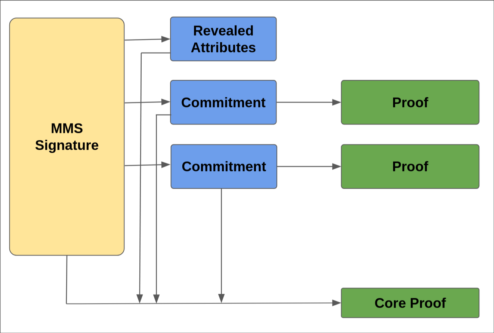

<br/>

# Specification for the implementation of Zero-Knowledge Proofs based on multi-message signatures in the EUDI Wallet

## Note

This technical specification captures exploratory work aimed at clarifying the technical considerations and outlining an approach for integrating zero-knowledge proofs based on multi-message signatures in the EUDI wallet ecosystem. It is not intended to be a final specification. Instead, it will be handed over to ETSI for further refinement, consolidation and formal standardization. In particular, the continued development of this specification is expected to take place under ETSI TS 119 476-2, where the detailed technical requirements and normative provisions will be fully defined.

### [GitHub discussion](https://github.com/eu-digital-identity-wallet/eudi-doc-standards-and-technical-specifications/discussions/467)

## Version

| Version | Date       | Description     |
|---------|------------|-----------------|
| `0.1`   | 19.12.2025 | Initial version |

## 1 Introduction and Overview

Multi-Message-Signature (MMS) schemes are a type of signature scheme that allows signing of multiple messages at once and are particularly friendly towards efficient Zero Knowledge Proofs (ZKPs), making them an interesting technology for the EUDI wallet ecosystem.
On the other hand, the relative immaturity of MMS schemes (compared to more established standard digital signature schemes) requires more effort to integrate into existing digital ecosystems.
Further, similar to circuit-based approaches for ZKPs, additional care is necessary for revocation of attestations to ensure that this does not harm the privacy benefits of the MMS-based approach.

### 1.1 ZKPs in [European Digital Identity Regulation]

Regulation (EU) 2024/1183 of the European Parliament and of the Council of 11 April 2024 amending Regulation (EU) No 910/2014 as regards establishing the European Digital Identity Framework [European Digital Identity Regulation], Recital 14, discusses the use of privacy-preserving technologies, such as zero knowledge proof:

> Member States should integrate different privacy-preserving technologies, such as zero knowledge proof, into the European Digital Identity Wallet.
> Those cryptographic methods should allow a relying party to validate whether a given statement based on the person’s identification data and attestation of attributes is true, without revealing any data on which that statement is based, thereby preserving the privacy of the user.

Similarly, Recital 15 of [European Digital Identity Regulation] mentions:

> All Union citizens [...] should be empowered to securely request, select, combine, store, delete, share and present data related to their identity [...] while enabling selective disclosure of personal data

Recital 59 of [European Digital Identity Regulation] provides the following definition and requirements for selective disclosure:

> Selective disclosure is a concept empowering the owner of data to disclose only certain parts of a larger data set, in order for the receiving entity to obtain only such information as is necessary for the provision of a service requested by a user.
> The European Digital Identity Wallet should technically enable the selective disclosure of attributes to relying parties.
> It should be technically possible for the user to selectively disclose attributes, including from multiple, distinct electronic attestations, and to combine and present them seamlessly to relying parties.
> This feature should become a basic design feature of European Digital Identity Wallets, thereby reinforcing convenience and the protection of personal data, including data minimisation.

Furthermore, Article 5a, 16 of [European Digital Identity Regulation] mandates for "the technical framework of the European Digital Identity Wallet" to:

> (a) not allow providers of electronic attestations of attributes or any other party, after the issuance of the attestation of attributes, to obtain data that allows transactions or user behaviour to be tracked, linked or correlated, or knowledge of transactions or user behaviour to be otherwise obtained, unless explicitly authorised by the user;
> (b) enable privacy preserving techniques which ensure unlinkability, where the attestation of attributes does not require the identification of the user.

Finally, article 11a.2 of [European Digital Identity Regulation] mandates that:

> Member States shall provide for technical and organisational measures to ensure a high level of protection of personal data used for identity matching and to prevent the profiling of users.

### 1.2 Document structure

This document is structured as follows:

- Section 2 outlines the scope of this specification, and in particular which high-level requirements are treated and which are not.
- Section 3 presents a modular architecture for ZKPs based on MMSs.
- Section 4 provides an overview of options for MMS schemes, their pros and cons, and makes recommendations for concrete MMS schemes both in short and long-term.
- Section 5 provides an overview of instantiations of additional modules needed to fulfill the high-level requirements.
- Section 6 discusses issuance of attestations based on MMS schemes.
- Section 7 discusses presentation protocol designs.
- Section 8 discusses data model and container format.
- Section 9 provides an overview of different options for revocation.

## 2 Scope

This document follows up on the [TS-4 - Specification for ZKP Implementation in EUDI Wallet](ts4-zkp.md) and complements [TS-13 - Specification for the implementation of Zero-Knowledge Proofs based on arithmetic circuits in the EUDI Wallet](ts13-zksnarks.md).
It assesses options for incorporating ZKPs based on MMSs and based on this defines a concrete construction for integrating a ZK presentation of an attestation using a MMS scheme in the EUDI ecosystem.

High-level requirements labeled with SHALL or MUST from [Section A.2.3.21. Topic 53 of Annex 2](https://github.com/eu-digital-identity-wallet/eudi-doc-architecture-and-reference-framework/blob/main/docs/annexes/annex-2/annex-2.02-high-level-requirements-by-topic.md#a2331-topic-53-zero-knowledge-proofs) are generally considered to be in-scope, with some exceptions as noted.
That being said, the next two sections will explicitly list the requirements considered to be in scope, respectively out of scope, for this Technical Specification.
Finally, the third section elaborates on the relationship between an electronic identification (eID) means at level of assurance (LoA) high and ZKPs as envisioned in the EUDI Wallet ecosystem.

### 2.1 In scope

- ZKP\_01, with the exception of hiding the PID Provider or Attestation Provider. Specifically:
  - Proving possession of a PID or attestation, while hiding some or all of its attributes.
  - Proving possession of a PID or attestation within its validity period.
  - Proving possession of a PID or attestation that has not been revoked.
  - Proving that PID or device-bound attestation is bound to a key stored in the WSCA/WSCD or in a keystore of the Wallet Unit.
- ZKP\_02: Proving that an attestation has a given type.
- ZKP\_03: Proving, in addition to ZKP\_01, that an attestation is bound to a PID.
- ZKP\_07: The ZKP mechanism must not involve additional communication that enables linkability.

### 2.2 Out of scope

- ZKP\_05: Proximity based flows.
- ZKP\_08: Only use of standardized algorithms.
- Pseudonyms.
- Issuer hiding (i.e., non-mandatory requirements from ZKP\_01).
- Parameters for instantiations of cryptographic schemes.
- Presentations combining different attestations.
- Investigation of intellectual property considerations related to cryptographic schemes referenced in this document.

### 2.3 eID means at LoA High and ZKPs

By Article 3 1-5 of the [European Digital Identity Regulation], an eID means is something that enables the confirmation of person identification data that uniquely represents a natural or legal person.
Such an eID means has a level of assurance associated with it.
As this data uniquely identifies the person, it does not make sense to talk about unlinkability of an eID means by itself.
However, allowing Relying Parties to obtain only partial information from an eID means can be valuable in privacy sensitive use cases.
Specifically, ZKPs can be used to prove statements about an eID means without identifying the person.
This can for example be used for age verification, where the Relying Party is given a proof that the PID of the User contains an attribute showing that the User is above a certain age, but without revealing either the exact age or the identity of the User.
In such cases, the Relying Party can rely on many of the underlying guarantees provided by the LoA High eID means (i.e., how it was issued and guaranteed protected by the User) while ensuring that the user remains completely untraceable (i.e., there are no fixed signature values or any other unique points for correlation that are part of the presentation of the proof).
Hence, rather than enabling "ZKPs at LoA High" the goal of this specification is to enable ZKPs (based on MMSs) to be based upon an eID means at LoA High.

## 3 Overview of ZKPs based on MMS Schemes

Multi Message Signatures (MMS) are digital signature schemes characterized by two properties:

- they allow the signer to *sign tuples of messages* of a fixed length $(m_1,\ldots,m_n)$ in a single signature $\sigma$
- they support efficient *Zero Knowledge Proofs of knowledge of a signature* $\sigma$ and of the attributes signed in it $(m_1,\ldots,m_n)$ while possibly selectively disclosing some of them.

The use of MMS in designing privacy-preserving digital credentials, that in this document will be referred to as attestations, is driven by the security guarantees provided through the following workflow, which is described in two phases:

- **Issuance**: An issuer using the key pair $(isk,ipk)$ can issue an attestation by signing with a MMS scheme the attributes $(m_1,\ldots,m_n)$ it wants to include in it, producing the signature $Sign(isk,(m_1,\dots,m_n))=\sigma$. The attestation is defined as $cred=\sigma$, and it is paired with the associated attributes $(m_1,\ldots,m_n)$. Then, $cred$ and $(m_1,\ldots,m_n)$ are given to a holder, who can verify the validity of the attestation running the verification algorithm of the MMS scheme $Verify(ipk,cred,(m_1,\ldots,m_n))$ under $ipk$.

- **Presentation**: When the holder wants to present attributes $`(m_i)_{i\in D}`$ issued by $isk$, it can run the presentation algorithm which outputs a presentation $pres$ which is a ZKP of knowledge of an attestation issued by the issuer with public key $ipk$ for the attributes $`(m_i)_{i\in D}`$. The verifier can run the verification algorithm of the ZKP to be assured that the prover actually owns such an attestation.

This workflow enables holders to generate *unforgeable* and *unlinkable* presentations. The unforgeability is the property that guarantees that only a prover with an attestation issued for $ipk$ and the disclosed attributes $`(m_i)_{i\in D}`$ can create a valid presentation: this property follows from the unforgeability of the underlying MMS scheme and the soundness of the associated ZKP used to generate the presentation. The unlinkability is the property that guarantees that presentations of attributes $`(m_i)_{i\in D}`$ issued for $ipk$ derived from different attestations are indistinguishable: this property follows from the Zero-Knowledge property of the ZKP.

Regarding the unlinkability property, if we define the anonymity set of a presentation disclosing $(m_i)_{i\in D}$ issued for $ipk$ as the set of the holders who own an attestation for these attributes issued for $ipk$, it is worth stressing that presentations leave the holder anonymous only within the anonymity set of the presentation. Of course, if a holder presents personally identifiable information, the anonymity set is given just the holder itself. It is also worth stressing that the anonymity of the holders within the anonymity set of their presentations holds even if the verifier colludes with the issuer of the presented attestation.

### 3.1 A Modular Approach for ZKPs based on MMS Schemes

So far, it has been shown how MMS schemes can be used to present attestations revealing a subset of the attributes and hiding the rest of them.
In this section it is described how MMS schemes can be employed within a framework enabling modular generation of predicate proofs (e.g. range proofs, set membership proofs) about *hidden attributes* and device binding while presenting attestations. This approach is not necessary per se, but has the following advantages:

- it provides simple instructions on how to incorporate predicate proofs and device binding with legacy devices within presentation protocols
- it enables synergies with related standardisation activities (e.g. Privacy Pass).

For this, we rely on two additional building blocks: Commitment Schemes and Zero Knowledge Proofs.

#### 3.1.1 Building Blocks

A ZKP system allows asserting the validity of well-defined statements without revealing any information (apart from the validity of the proven statement). It must satisfy the following properties:

- Completeness: If the statement is true and both the prover and verifier follow the protocol correctly, the verifier will be convinced of its validity.
- Soundness: If the statement is false, a dishonest prover cannot convince an honest verifier that it is true, except with some negligible probability.
- Zero-Knowledge: If the statement is true, the verifier learns nothing beyond the fact that the statement is correct.

A commitment scheme allows a party to create a *commitment* to a value that can later be opened and reveal the committed value. This can be though of as a digital analogue of encapsulating a value in an envelope. This guarantees that the (1) the value remains hidden until the commitment is opened, and (2) the committed value cannot be changed after being committed. These properties, *hiding* and *binding* respectively, are captured as follows:

- Hiding: The commitment does not reveal any information about the committed value,
- Binding: It is computationally infeasible to open a commitment to a value different from the one that was committed to.

#### 3.1.2 Committed Disclosure

To enable a modular generation of predicate proofs about *hidden attributes*, a commitment scheme is used in addition to the MMS scheme.
The idea is the following: in the presentation phase, the prover who wants to create a proof about a hidden attribute $m_i$ generates a *fresh commitment* $C_i$ to $m_i$, and proves the equality between the attribute in the attestation and the attribute committed in $C_i$.
Concretely, the User proves the statement "I know a signature $\sigma$ on attributes $m_1,\ldots, m_n$ issued under the issuer's public key $ipk$ and an opening of the commitment $C_i$ to the $i$-th attribute $m_i$". This statement is proven in an individual proof, which is called the "core" presentation proof.

Following [LSZ2025] we refer to this capability as *committed disclosure (CD)*. This captures the ability to make (ZKP) presentations that *disclose some attributes and simultaneously disclose commitments to attributes*. Having attested the consistency of committed attributes with the issued attestation we can prove arbitrary statements about them using appropriate ZKPs. We elaborate on this next.

#### 3.1.3 Proving Additional Functionalities

Let $P$ be some predicate we want to prove on an attribute without revealing it. For example, $P$ can capture "attribute is in the range $[l, h)$". To do so, the User adds it to the *committed attributes* and proves that the corresponding commitment $C_i$ is consistent with the credential - in the sense that it is a commitment to the $i$-th attribute - via the core proof as described in [Committed Disclosure](#312-committed-disclosure). Then another ZKP proof is employed to assert that $C_i$ satisfies $P$. The proven relation captures that:

1. $C_i$ is a commitment to some value $m_i$,
2. $m_i$ satisfies the predicate $P$.

Since the commitments for each presentation are fresh, no linkable information of the attestation holder is given during the presentation; this follows by the hiding property of the commitment and the zero knowledge property of the ZKP. Additionally, the User can only open the presented commitments to the corresponding attributes of the attestation; this follows from the binding property of the commitment scheme and the soundness of the ZKP. This approach naturally generalizes for proving predicates about multiple attributes.

#### 3.1.4 Putting it all together

We next describe the workflow of a presentation with selective disclosure of some attributes and an attestation that the (hidden) $i$-th attribute $m_i$ satisfies predicate $P$.

- The User creates a fresh commitment $C_i$ to the attribute $m_i$ and sends it along with the disclosed attributes to the relying party. It also sends two proofs: (1) the core proof, asserting that the disclosed attributes and the attribute in $C_i$ are contained in an attestation under some issuer's public key $ipk$; and (2) a proof that the opening of $C_i$ satisfies $P$.
- The relying party verifies the two proofs. Importantly, it uses *the same commitment* for both. This guarantees that the predicate $P$ is satisfied by the attribute $m_i$ contained in the signed attestation.

In the next image we demonstrate the presentation based on the above approach. The verifier only sees the provided commitments, the proofs, and the revealed attributes.



While any combination of MMS scheme, commitment scheme and ZKP could in theory work to perform the committed disclosure, the building blocks should be "compatible" in the sense that the corresponding "core" proof can be efficiently generated.

Finally, we emphasize that there are already public implementations that follow this approach, in particular [DockNetworks](https://github.com/docknetwork/crypto/tree/main/equality_across_groups), which also has support for some of the more complex predicates such as device binding.

#### 3.1.3 Considerations on committed disclosure

The modular approach that relies on the committed disclosure to prove predicates about attributes allows to separate proving knowledge of a MMS and proving predicates on some of the signed attributes. In this section we list some of the main pros and cons about the use of this approach:

**Disadvantages**

- The resulting proof might result to be less compact and computationally more expensive than a tailored predicate proof that extends the ZKP to prove knowledge of the MMS. For instance, the generation and the inclusion in the proof of the fresh commitments already brings a computational and size overhead. That said, for the instantiations proposed in this work this is hardly an issue since the corresponding overheads are just a few bytes and few milliseconds.

**Advantages**

- Standardization efforts can focus on how to prove predicates on attributes committed using a commitment scheme being oblivious of the underlying MMS scheme. These standards can be applied to any MMS that employs committed disclosure using the same commitment scheme.
- Arguing about security becomes easier since each component/module can be analyzed individually.
- Different countries might accept for adoption different lists of predicates on attributes. The framework based on the use of committed disclosure only requires the member states to reach full consensus on the acceptance of equality proofs. These are needed to prove that the freshly generated commitments commit to specific attributes in the attestation. Then, wallets of different member states can implement the specific set of predicate proofs they are willing to adopt.
- Making changes in the future becomes less challenging: each module can be modified/replaced with minimal impact on other components of the system. Further, extensions to the system can be implemented in an ad-hoc way.

## 4 MMS Schemes

A number of MMSs have been proposed in the cryptographic literature.
Broadly, they can be divided into two categories: they use RSA-like cryptography, or they are based on elliptic curves.
Generally, MMSs that use elliptic curves are deemed most suitable, as they are more modern and more performant.
Many of these MMSs require a special kind of elliptic curves called pairing-friendly curves.
These kinds of curves enable efficient algorithms for the RP to verify a disclosure, but support for these kinds of curves in currently available secure hardware is sparse.
In this subsection, we discuss a number of elliptic curve-based MMSs as well as some considerations about them in general.

### 4.1 General Considerations for elliptic curve-based MMS Schemes

There are several key considerations for using a pairing-based MMS in the EUDIW context, including those related to issuers, users, and verifiers. Each is outlined in the subsections below.

One thing that applies to all three parties concerns revocation.
For mdocs and SD-JWTs, EUDI wallets generally use the Token Status List (draft) standard [IETF-draft-TSL]. This standard endows attestations with a unique identifier that must always be revealed to the RP, which breaks unlinkability.
It is not immediately clear how to handle revocation of attestations without breaking unlinkability, but whichever revocation mechanism is chosen will require support from issuers, wallets and RPs.
For more information on various revocation mechanisms that might be suitable, see [Section 9](#9-revocation).

#### 4.1.1 Issuer considerations

The primary consideration for issuers is that deploying an MMS requires changes to both existing processes and infrastructure. These changes arise from how signatures are generated.

Currently it is unclear how PID/(Q)EAA Providers can generate MMS signatures for eID means at LoA High, since currently available HSMs generally do not support MMS signatures, nor pairing-friendly elliptic curves.
Suitable pairing-friendly curves are still under standardization in [IETF-draft-pairing-friendly-curves].
Broad hardware support for their use as well as hardware support for MMS signature schemes in signing EUDIW attestations is unlikely in the near term due to the absence of finalized standards and the long lead times for deploying hardware at scale.

One way of easing this issue with this could be to modify the MMS such that it can operate on ordinary elliptic curves instead of pairing-friendly elliptic curves.
This is discussed in more detail in [Section 4.3](#43-pairing-free-mmss).
Another way could be to distribute the MMS private key over more than just one issuer.
In this scenario, multiple issuers that each have part of an MMS private key would have to collaborate to create a single MMS signature, in order to minimize the impact if any one of the parts of the MMS private key leaks.
This is possible for both of the MMSs discussed below, see for example [DKLST2023].

#### 4.1.2 Client considerations

The client must support the MMS signatures too.
Specifically, signature randomization and selective disclosure using zero-knowledge proofs to enable privacy-preserving presentations.
This is expected to be feasible, assuming sufficient library support.

A more complex requirement is device binding.
While several academic proposals exist, they have not been field-tested.
Further work is needed to assess their suitability and develop implementation support.

#### 4.1.3 Verifier considerations

Verifier requirements include support for the MMS signature scheme, including the ability to validate signatures.
In the case of pairing-friendly curves, this requires the RP to perform pairing operations.
Verifiers must also be able to process and validate disclosed attributes in the presentation.

Importantly, all of this can be implemented in software, assuming the availability of finalized standards and mature library support.

#### 4.1.4 Strategies

The main barrier to MMS adoption is the lack of issuer infrastructure support.
MMSs are not compatible with existing HSMs that issuers could use, significantly limiting its deployment.
Three potential paths forward are outlined below:

1. Defer MMS adoption for PID at LoA High until hardware support matures.
   This is not ideal, as hardware vendors are unlikely to invest without clear demand signals.
2. Introduce a PID alternative at LoA Substantial using an MMS, enabling privacy protection at this level while deferring LoA High support until the necessary prerequisites, such as hardware support, are in place.
   This could also incentivize hardware support through demonstrated demand.
   While it still requires issuer changes, these changes are less extensive.
3. Prevent requiring changes in issuer (hardware) infrastructure by having the issuer create an HSM-backed ECDSA signature on top of the MMS signature to achieve LoA High. Users would present attestations combining the zero knowledge proofs of the MMS with circuit-based zero knowledge proofs to prevent linkability that would otherwise be introduced by the ECDSA signature.
   This would achieve unlinkability simultaneously with LoA High, while minimizing changes to issuer infrastructure.
   It also offers a migration path to the underlying native MMS once hardware support becomes available.
   How this should be done depends on the specific MMS and requires further study.
   An example for how this could be done for BBS can be found in [Appendix A](#appendix-a) below.

### 4.2 Pairing-Based MMS Schemes

Like ECDSA, many of the MMS schemes recently proposed in the cryptographic literature use elliptic curves, but unlike ECDSA they often require a special kind of elliptic curves, namely *pairing-friendly* elliptic curves.
A pairing-friendly curve is a curve $\mathbb{G}_1$ which is such that there exists other, related elliptic curves $\mathbb{G}_2$ and $\mathbb{G}_T$, along with an efficiently computable function $e : \mathbb{G}_1 \times \mathbb{G}_2 \to \mathbb{G}_T$ which is *bilinear*.
Bilinearity means that for all $g, h$ and $a$, $b$ the function $e$ satisfies $e(g^a, h^b) = e(g,h)^{ab}$.
Additionally it has to be *non-degenerate*, meaning that $e(g, h) = 1$ if and only if $g = 1$ or $h = 1$ (or both).
Only certain elliptic curves allow the existence of such a function $e$ (and notably, the elliptic curves generally used by ECDSA does not).
In MMSs, this function (in particular, its bilinearity property) is used by the RP to verify that the disclosed attestation has been validly signed by the issuer.

#### 4.2.1 BBS

The BBS signature scheme (sometimes also called BBS+) was introduced in [BBS04] as part of a group signature protocol based on discrete logarithm assumptions in groups admitting bilinear pairings.
In subsequent work, [CL04] describes BBS as a standalone multimessage signature scheme, supporting efficient issuance and proof protocols over committed messages.

Later, [ASM06] provided a version with provable security, perfect zero knowledge, and improved efficiency.
[CDL16] extends BBS to type-3 bilinear pairings and proposes a more efficient proof of knowledge.
Most recently, [TZ23] presents a shorter and more efficient variant, which underpins ongoing IETF standardization efforts [IETF-draft-bbs] and the text herein.

Compared to other MMSs that offer similar features, BBS signatures are short (consisting of one elliptic curve element and one scalar), as well as efficient to issue, verify, and prove knowledge of.
In addition, it allows the wallet to prove predicates such as range proofs over the attributes that it does not disclose.

In implementations, BBS generally uses the BLS12-381 pairing-friendly elliptic curve, for which a draft standard has been written [IETF-draft-pairing-friendly-curves].
Additionally, for the zero knowledge proofs the so-called *Schnorr zero-knowledge proofs in the Fiat-Shamir heuristic* are generally used, which is structured as follows: first the RP sends a nonce (also called challenge), and then the wallet replies with its proofs.
In terms of protocol messages, this has the same structure as an (ECDSA) Proof-of-Possession (PoP), meaning that this is compatible with the protocol structure of existing protocols such as OpenID4VCI and OpenID4VP for issuance and disclosure of attestations based on ordinary signature schemes (e.g., ECDSA).

##### 4.2.1.1 Security level

BBS signatures are provably unforgeable under the q-SDH hardness assumption.
The concrete security that the q-SDH hardness assumption can attain is affected by a known cryptanalytic technique by Cheon [C06], which has existed since 2006.
Recent work [CT2025] presented an explicit algorithm to apply this technique to BBS and thereby showed that the actual security level of BBS is no higher than the provable security level. This means that the most commonly used curve for BBS, namely BLS12-381, would result in a security level of less than 128 bits.

The simplest way to deal with this is to deploy BBS on an elliptic curve that is sufficiently large to compensate.
[AFG2024] defines the BLS24-509 curve which offers a security level of 192 bits, which is expected to appear in an upcoming version of [IETF-draft-pairing-friendly-curves].
Due to how Cheon's algorithm works, this is sufficient in the sense that the security level of the BBS deployment is then 128 bits.

It should be noted that the q-SDH hardness assumption is a well known hardness assumption that has been used by many schemes in the cryptographic literature.
As a result, it has received a significant amount of attention and study by cryptographers.
Regardless of that, since 2006 when Cheon's algorithm became known q-SDH has resisted all further cryptanalysis looking for any other potential issues affecting its security level.
In that sense, q-SDH remains a solid and battle tested hardness assumption.

Given the above analysis, we recommend the following approach.

- Since a lot of BBS implementations using the BLS12-381 curve already exist, and that BLS24-509 is not yet in a (draft) standard, in the short term BBS on the BLS12-381 curve could be used.
  If BBS were to be combined with ECDSA as described in [Appendix A](#appendix-a), this even keeps the security to that of ECDSA, which is suitable for LoA High.
- Migrate to the BLS24-509 curve as soon as possible.

#### 4.2.2 PS

The PS signature scheme was introduced in [PS16], but should be understood as a specific instantiation of a broader framework that is implicit in the Camenisch's and Lysyanskaya's signature construction [CL04]. The CL signature scheme is a re-randomizable signature scheme, meaning that one can publicly derive, from a valid signature on a set of messages, a new signature on the same set of messages. This property is particularly useful in the context of privacy-preserving authentication as one can merely re-randomise a certificate instead of hiding it in a ZK proof. The main downside of CL signature is its size, which grows with the number of attributes to sign. This problem was solved by the PS construction [PS16] that retains the key features of CL signatures (re-randomizability, sequential aggregation, etc) while achieving a constant size for the signature, namely two elements in $\mathbb{G_1}$, regardless of the amount of attributes in the attestation.

Structurally, CL and PS signatures differ from BBS signatures to such a degree that the [CT2025] attack does not apply. In other words, there are no known concrete attacks against CL and PS signatures that would perform better than standard discrete logarithm computation, which means that BLS12_381 remains, as of today, a valid option for implementing these mechanisms at a 128-bit security level.
More generally, security of PS signatures was initially proven in the generic group model, and later demonstrated using automated tools [ABS16]. Another paper [PS18] showed that variants of CL and PS signatures can also be proven under q-type assumptions, but the latter result does not seem optimal in light of Cheon's attack.

Overall, one must note that PS and BBS should not be opposed. They have different features, suiting different needs, and they rely on different security arguments, providing the cryptographic diversity that is promoted by most standardisation bodies.  

### 4.3 Pairing-Free MMSs

Bilinear pairings are widely used in MMS design to let the User prove to the Relying Parties that it is presenting an attestation issued by the issuer. With bilinear pairings any Relying Party can verify it only using the issuer public key. An exception are the strong RSA-based CL signatures [CL01]. While pairing-free, they are less efficient than elliptic curve based schemes, due to their reliance on RSA groups.

However, as explained in the previous section, requiring a pairing-friendly elliptic curve might delay deployment of MMS schemes that can reach LoA High because currently available secure hardware does not generally support pairing-friendly curves.
For that reason, various ways have been suggested recently to adapt MMS schemes such that they can operate on ordinary, widely supported elliptic curves.

In the elliptic curve based setting, pairing-free variants all require some trade-off in terms of deployment. For instance, one-time use anonymous attestations such as U-Prove [UProve] or Anonymous Credentials Light [BL13] are based on blind signatures extended to include attributes. Blind signatures are inherently single-show credentials, and thus require batch issuance of credentials for multi-show unlinkability.

Another way to remove the need of bilinear groups is by instructing Relying Parties to interact with the issuers of attestations during each disclosure in order to help them verify the presentations they receive. This of course brings complexity to the system design since it requires issuers to be available to support Relying Parties in each verification.

An alternative to this approach instructs the Users to receive batches of helper information from a Helper Server, after which the User can use the Helper information at some later time to generate unlinkable presentations that Relying Parties can verify on their own. The Helper Server issues helper information in batches because each instance must be used only once to preserve the unlinkability of presentations. This approach, referred to as Server-aided Anonymous Credentials (SAAC), was first introduced along with an instantiation called BBS# [DDKT25] (implemented for instance in [DockNetwork](https://github.com/docknetwork/crypto/tree/main/kvac/src/bbs_sharp)), and later formalized in [CFLT2025].

**Disadvantages**

- If the User generates presentations using helper information, then the protocol flow inherits the scalability issues for issuers existing for the batch issuance of single-use ECDSA attestations
- If Relying Parties verify presentations with the support of the Issuer, the Issuer must guarantee high availability

**Advantages**

- Being defined over standard elliptic curves, support in HSM for protecting the issuance private key can probably be achieved faster and easier.
- Binding a credential to a holder's secure hardware is simpler because the secure hardware and the MMS can be defined over the same elliptic curve; for instance, BBS# proposes a solution for device-binding from ECDSA-signatures, relying on re-randomization of ECDSA signatures and public keys
- Compared to the case where Relying Parties verify presentations with the support of the Issuer, both Users and Relying Parties can be offline while generating and verifying presentations of attestations
- Compared to batch issuance of single-use ECDSA attestations:
  - The protocol to obtain helper information is more efficient compared to a protocol that enables the (possibly blind) issuance of attestations: the helper information is not related to the attributes of the User, but is related only to the issuer key pair.
  - The User is protected against traceability (Issuer and Helper Server colluding with Relying Parties).
  - The Helper Server does not learn which User is asking for a batch of helper information: this implies that the Helper Server does not even learn how long it took the same User to use the previous batch of helper information.

### 4.4 MMS Deployment Strategy

MMS schemes smoothly interact with ZK proofs and have been scrutinized for a long time. In their pairing-versions, regardless of the concrete instantiation, they offer performance that can hardly be matched by their competitors. They perfectly address the security and privacy requirements of the EUDI wallet and were actually designed to this end. They however face some deployment challenges due to the lack of support by current secure hardware (HSM, secure element, etc). When considering MMS deployments, one can thus envision two main phases.

- Phase 1 (short/medium term): In this phase, it is assumed that the hardware support for pairing-based MMS is very low. The path forward would then be as follows:
  - For PID at LoA high, one would either implement the pairing-free variants of MMS presented in Section 4.2 or combine pairing-based MMS with ECDSA using circuit-based ZK proofs.
  - For PID at LoA Substantial, pairing-based MMS would be recommended, to incentivize hardware support and thus pave the way to Phase 2.
- Phase 2 (medium/long term): In this phase, it is assumed that pairing-based MMS schemes are now broadly supported by hardware, which allows to use them even for LoA high.

When comparing MMS with alternative approaches, it is thus important to note that Phase 1 solutions at LoA high are only transitory solutions. The full potential of MMS will only be achieved in Phase 2, at which stage they will arguably supersede other approaches.
The distinction between these two different phases also highlights that direct comparison between some of the solutions listed in previous sections is irrelevant. There is for example no point in comparing efficiency or features of PS and BBS# as they fit very different scenarios and requirements.

### 4.5 Comparison and Recommendation

#### 4.5.1 Pairing-based MMSs

Looking at BBS and PS, the two MMSs compare as follows.

**Security**

- **BBS**: The unforgeability of BBS is based on the q-SDH hardness assumption.
  This hardness assumption has existed since 2003 and has been used in many cryptographic works since then. The security level of the q-SDH hardness is affected by a known cryptanalytic technique called the Cheon attack [C06]; see [above](#4211-security-level).
- **PS**: The paper [PS16] that introduced PS signatures also introduced the hardness assumption on which it is proven unforgeable.
  It is therefore newer and does not seem as widely used as q-SDH.
  It is moreover an interactive hardness assumption, whereas noninteractive hardness assumptions such as q-SDH are generally deemed preferable.

**Ecosystem and Adoption**

Generally, BBS is more well known and there are more (open source) implementations of it than of PS.

**Efficiency**

- **BBS**: Due to the considerations in [Section 4.2.1.1](#4211-security-level), BBS will eventually require an elliptic curve offering 192 bits of security.
- **PS**: Can be deployed on an elliptic curve such as BLS12-381 offering 128 bits of security, which should be more efficient.
  However, the size of a PS issuer public key depends linearly on the number of attributes that can be issued with it.
  By contrast, the size of a BBS public key is constant.

It should be noted, however, that in practice both MMSs are efficient to such a degree that it is unlikely that any performance difference would exceed 100ms.
In practice, therefore, any efficiency differences between the two matter very little.

All in all, the most promising MMS candidate for now seems to be BBS which seems overall to have a slight edge over PS. Note that because of the modular approach (suggested in Section 3), most of the components can be reused across such schemes if multiple were to be supported.  

#### 4.5.2 Pairing-based vs Pairing-free

Several approaches enabling the use of ordinary elliptic curves, instead of pairing-based ones, have been discussed in [Section 4.3](#43-pairing-free-mmss).
By itself, this is not sufficient to enable the issuer to secure its private key in an HSM, since in order to be useful in an MMS deployment the HSM will additionally need to support the MMS signature scheme itself.
Not having to additionally support newer elliptic curves might speed up the process of obtaining suitable certified HSMs, not only because it would involve fewer changes when compared to currently available HSMs, but also because (at least in the case of BBS) the HSM will need to support elliptic curve operations in both $\mathbb{G}_1$ and $\mathbb{G}_2$.

On the other hand, as discussed earlier, each of the pairing-free approaches brings its own disadvantages.
In addition, the ECDSA/MMS hybrid approach suggested in [Section 4.1.4](#414-strategies) might be an alternative that can achieve LoA High on pairing-friendly curves.

Therefore, we suggest further developing that approach in the short term (Phase 1 in the previous section), and switching to HSMs supporting pairing-friendly curves as soon as they become available.

## 5 Additional Modules

This section presents the techniques that can be used to build predicate proofs about the attributes of an attestation. The User, during presentation, generates fresh commitments $C_i$ to the attributes about which it wants to prove predicates. Then, the User can generate predicate proofs involving the attributes $a_i$ committed in $C_i$ proving a statement like "the attribute committed in $C_i$ satisfies the predicate".

For the MMSs we consider in this document, the commitment schemes that can be used to efficiently perform committed disclosure are Pedersen commitments. In the following we briefly describe how to implement the following predicates:

- Device Binding
- Range Proofs
- Equality Proofs
- Set-membership Proofs

### 5.1 Device Binding

Device binding aims at non-transferability of attestations. It binds the User's attestations to a device key that is stored in a particularly secured hardware component -- dubbed the Wallet Secure Cryptographic Device (WSCD) in the EUDI ecosystem -- and requires a fresh proof-of-possession (PoP) of the device key for every attestation presentation. Native device binding protocols for MMS schemes have been developed and are highly efficient. However, current available WSCDs do not provide the APIs necessary for the native approaches. For short-term deployment, device binding solutions that are compatible with the currently existing APIs are therefore necessary. We start by sketching possible short-term solutions that rely only on standard ECDSA signatures for the PoP (which we denote explicit device binding), and then point to the native solutions.

#### 5.1.1 Explicit Device Binding

The idea of explicit device binding is to rely on the classic approach of including a device public key $dpk$ as an attribute in the user's attestation. Then, every presentation must be accompanied with a fresh PoP of the corresponding $dsk$ which is simply a valid signature $\sigma$ under $dsk$ on a challenge $nonce$ sent by the Relying Party.  To do this in a privacy preserving way, neither the public key nor the signature should be revealed. Instead, the user commits to both and proves their correctness via ZKPs. That the public key is the one attested in the User's attestation is proven via the MMS and core proof. Both proofs are combined through the committed public key. The corresponding device binding predicate captures the following:

1. $dpk$ is committed in $C_{dpk}$
2. $\sigma$ is committed in $C_{\sigma}$
3. $\sigma$ is a valid signature of the message $nonce$ under $dpk$.

For efficiency reasons, some constructions may reveal parts of the signature, but only when they contain no information about the User and its $dpk$. Note that the  message $nonce$ is known to the Relying Party, and thus revealed in clear.

A common candidate for the signature scheme is ECDSA over the P256 elliptic curve, as this is supported by common WSCDs.
Thus, when using such ECDSA-based device binding with a pairing-based MMS, such as BBS, one needs to additionally bridge the ECDSA public key and signature in the P256 curve with the pairing-curve of BBS (e.g., BLS12-381). This bridging across groups, and proving knowledge of an ECDSA signature,
are relatively difficult to construct. Two main approaches exist: either an optimized circuit-based ZKP (for example some adaptation of [Fs24]) or techniques similar to [CDLS] and [ZkAttest], which rely entirely on classical Schnorr proofs. The Schnorr-based approach has been implemented by [Ubique](https://github.com/UbiqueInnovation/zkattest-rs) and [DockNetworks](https://github.com/docknetwork/crypto/tree/main/equality_across_groups), whilst [Sigpop](https://github.com/pag-crypto/sigpop) implements the circuit-based approach. In the [pairing free variant](#43-pairing-free-mmss) ECDSA device binding is compatible with existing WSCDs through a standard ECDSA interface.

**Comparison of circuit-based and Schnorr-based approaches.** As for efficiency, circuit-based approaches tend to be faster for proving/verifying. Schnorr-based constructions tend to be simpler than circuit-based ones, which could make implementation and standardization easier, and are also compatible with the MMS schemes we consider in this document. They require, however, an additional elliptic curve, specifically the T256 curve proposed in [ZkAttest] (this is also the case for some circuit-based solutions which use this curve for optimizations). This T256 curve, however, has not been standardized yet.

**Comparison with attestation system based on ECDSA and circuit based ZKPs.** A solution relying on an MMS and a separate module for ECDSA device binding is much simpler than attestations directly built with ECDSA (i.e., ECDSA is used also for attribute signing). Indeed, when using ECDSA only for device binding, a simpler statement needs to be proven since (1) the nonce is a public message that does not identify the user and (2) revealing part of the ECDSA signature is possible without compromising privacy (as the PoP signature is only used once, and only known to the User).
In particular, no statement over a hash function must be proven, which is often the most complex part when using a circuit-based ZKP. Therefore, solutions using a dedicated MMS for proofs over attributes and ECDSA only for the device binding part are inherently simpler and lighter than a construction using ECDSA for both. Separating the signature scheme used for signing the attributes and for device binding allows flexibility and enables making optimal choices for both (an efficient scheme for handling attributes and a legacy one that is widely deployed).

#### 5.1.2 Native Device Binding

Native device binding essentially follows the same concept as explicit device binding, but has a PoP already integrated into the MMS's ZKP.
The most established way for such native device binding of anonymous attestations/MMS is the Direct Anonymous Attestation (DAA) protocol [DAA]. DAA essentially requires a simple Schnorr signature (in $\mathbb{G}_1$ of the pairing-friendly curve) from the WSCD and only a single exponentiation per presentation.
That is, the WSCD does not have to compute the full ZKP over the MMS, but essentially only the proof of possession of the device secret key to which the attestation is bound, which takes a few milliseconds.
The DAA protocol was ISO standardized (for BBS and CL signatures) in 2013 [ISODAA], and is supported by the TPM2.0 standard. The interfaces were designed to support a broad range of MMS, and the ISO standard has recently been updated to also include PS signatures [ISODAA23].

DAA requires two calls to the WSCD per presentation and requires the WSCD to keep state among both calls. This has recently been improved in [FHLL25] which only needs access to a standard BLS-signature interface on the WSCD, i.e., requires only a single API call and no state. It is also the first protocol for BBS signatures that does not require trusting the WSCD for unlinkability and comes with a privacy-preserving variant for remote HSM settings as currently considered in several member states.

Such native device binding will be significantly more efficient than any ECDSA-based solution, and suitable for offline scenarios where bandwidth is very limited. However, it requires WSCDs to add new interfaces, e.g., for Schnorr or BLS signatures over a pairing-friendly curve. BLS signatures are an interesting stand-alone signature that provides easy mechanisms for key splitting and blind signing. Using BLS signatures for device binding immediately provides several advanced capabilities for the user/device key management.

### 5.2 Range Proofs

A range proof allows showing that an attribute lies in some range without revealing anything more about it. They can be used for implementing various features (revocation, non-expiration, pseudonyms amongst others). To prove that an attribute $m$ lies in some range $[l, h)$, the user produces a commitment $C$ to it during presentation and then uses a ZKP to prove that $l\leq m < h$. Concretely, the User computes a fresh commitment $C$ to the attribute $m_i$ that needs to be range-checked and a ZKP is used to prove a predicate that captures that

1. $m_i$ is committed in $C$
2. $l\leq m_i < h$

There are various option of instantiating the ZKP with different trade offs. Some examples are Bulletproofs [BBB+18], polynomial commitment techniques [BFGW20], and square decomposition [CGKR22]. A survey of zero knowledge range proofs can be found in [CBCM+24].

### 5.3 Equality

Equality proofs allow a User to prove that a committed attribute equals a message committed in an external commitment $C_{ext}$. This module can be useful to link presentations of different attestations by proving that they share a same random attribute, realizing [Combined Presentation of Attestations](https://eudi.dev/2.7.3/discussion-topics/k-combined-presentation-of-attestations/) as specified in the ARF in a natural and simple way.

Assuming an external commitment $C_{ext}$ (which in practice is derived from a presentation of a different attestation), the user computes a fresh commitment $C$ to the attribute $s$ and uses a ZKP to prove a predicate capturing that:

1. $s$ is committed in $C$
2. $s$ is committed in $C_{ext}$

For the concrete case of linking attestations, the User can simply add the "linked" attributes in the set of committed attributes for both presentations (thus establishing consistency with both attestations) and use a single proof for the equality predicate. Equality proofs of attributes committed in Pedersen commitments can be generated using a well known and simple modification to Schnorr zero knowledge proofs.

Various implementations are available, for example [DockNetworks](https://github.com/docknetwork/crypto/tree/main/equality_across_groups) and [Sigma Proofs](https://github.com/sigma-rs/sigma-proofs).

### 5.4. Set Membership

Set membership proofs allow a User to prove that a committed attribute has a value within a set $S=\{s_1, s_2, \ldots, s_n\}$ of values without disclosing the value of its attribute. This module can be useful to prove for example that the citizenship of the User is within a set $S$ of countries. The User computes a commitment to the attribute $m_i$ that needs to be restricted to belong to $S$ and uses a ZKP to prove that:

1. $m_i$ is committed in $C$
2. $m_i = s_1$ or $m_i = s_2$  ... or $m_i = s_n$.

Set membership proofs of attributes committed in Pedersen commitments can be generated using the standard compiler for OR proofs that turns a sigma protocol for equality proofs into a OR proof [CDS1994]. A relevant implementation can be found in [Sigma Proofs](https://github.com/sigma-rs/sigma-proofs).

## 6 Issuance

### 6.1 Data that must be Issued

To enable ZKPs base on MMSs, the data being issued must contain

- An issuer signed header containing information that is always disclosed. This header contains
  - An algorithm (signature scheme + curve) identifier (either explicit or implicit since that format is only used with one algorithm)
  - Other possible metadata entries that are always disclosed (e.g., policies embedded in the credential that must presented)
- The list of messages / attributes that the signature is constructed over with their respective indices (either explicit or implicit via an ordered list)
- The device public key that the credential is bound to - can be conveyed in one or more (potentially blinded) messages (e.g., BBS#, DBAC) or a special construction that is part of the signature scheme itself (e.g., DAA type proof)

### 6.2 OID4VCI for MMS

Below we list the relevant extension points in OpenID4VCI for transferring the data listed above.

The so called `proof` object used for a Proof of possession. OpenID4VCI currently supports the following proof types:

- `jwt`: A JSON Web Token that is signed with the device private key and contains a server-provided challenge
- `di_vp`: A W3C Verifiable Presentation object signed using the Data Integrity Proof
- `attestation`: A key attestation that also contains a server-provided challenge and the device public key. Signed by a trusted source (e.g., secure element, or Wallet Provider)

Which of these can be used heavily depends on the device binding construction, but the current assumption is that most constructions will provide a device binding bridging to ECDSA & P-256 since those are commonly supported in currently available smartphone hardware. For those, the `jwt` or `attestation` proof types can be used during issuance for the proof of possession - requiring no changes compared to the issuance of credentials of types SD-JWT VC or mDoc.

The most important extension point in OpenID4VCI are **Credential Format profiles**, with some being defined in Appendix A:

- W3C VCDM based credentials of different variants
- ISO 18013-5 / mDoc
- IETF SD-JWT VC

A credential Format profile defines:

- **A credential Identifier**: A string representing the credential format in the scope of OpenID4VCI / issuance
- **Credential issuer metadata**: Credential format specific metadata used to identify supported algorithms (for both, credential signature scheme and device binding) and specify any format specific properties (e.g., information representing the type of credentials being offered, dependant on the chosen data model - for example doctype for mdoc, or vct for sd-jwt vc)
- **Authorization details**: How `authorization_details` is specified if instead of scopes, a Rich Authorization Request (RAR) is used by the issuer.
- **Credential response**: The definition how an issued credential is transmitted in the JSON object returned by the credential endpoint (e.g., base64 encoding if the native serialization of the format is binary)

An MMS would need to define those components, but construction is straightforward if a choice on the used container format is made (see discussion below).

## 7 Presentation

### 7.1 ZKPs in a presentation

The presented data contains

- For the core credential proof:
  - An algorithm identifier (proof scheme + curve)
  - A list of disclosed attributes including their indices
  - Additional inputs that were used in the proof generation (e.g., additional transaction data that the presentation is bound to)
  - The encoded proof to be verified
- A list of sub-proofs if applicable, where each sub-proof contains
  - An input commitment (that is part of the list of the commitments provided in the core proof)
  - A proof type identifier (e.g., an identifier signaling that this is a range proof using a bulletproofs construction)
  - The encoded proof to be verified

### 7.2 OID4VP for ZKPs based on MMS

The relevant extension point for ZKPs based on MMSs in OpenID4VP are **Credential Format Specific Parameters and Rules**. OpenID4VP defines such parameters and rules for credentials based on W3C VCDM 2.0, ISO 18013-5 mDoc, IETF SD-JWT VC in Appendix B. They usually consist of:

- **Format identifier**: An identifier representing the credential format and its encoding rules
- **Transaction data rules**: Defining a credential data mechanisms that specifies how credentials of this type deal with `transaction_data` and if applicable how its presence can be verified in the resulting proof. For most MMS schemes, defining a construction that adds a hash over the `transaction_data` input from the request into the challenge hash that is also used for additional input like audience binding and nonce should be sufficient. Additional rules might have to be defined on a per transaction data type level and are out of scope for this discussion.
- **Metadata**: Credential format specific metadata provided by the Relying Party that allows the wallet to decide if a presentation will be understood by the RP. Usually defines a list of supported algorithm identifiers (credential signature scheme and device binding)
- **Query Language adjustments**: Credential format specific extensions to the query language/logic. Usually consists of the definition of the content of the `meta` parameter that is used to transport format-specific information (e.g., information that allows for credential type matching such as `doctype_value` for mDoc or `vct_values` for SD-JWT VC).
- **Presentation Response**: Format and Encoding of the transmitted data and if applicable a description on how to map components to a request (especially the query language mapping).

An example for such a definition (without transaction data) can be found in earlier versions of OpenID4VP for the CL-signature based AnonCreds construction: [OpenID4VP draft 26](https://openid.net/specs/openid-4-verifiable-presentations-1_0-26.html#name-anoncreds)

Note that some extensions to the query language defined in OpenID4VP (DCQL) will be necessary to express the full range of possible sub-proofs / predicate proofs. There are concepts on how to express more advanced logic on top of claims, but the decision was made to not include them for OpenID4VP 1.0 and wait for more implementers experience before adding any extensions. One such options discussed was to extend claim matching in DCQL with "Transformed Claims" as defined in [Section 8 of OpenID Connect Advanced Syntax for Claims](https://openid.bitbucket.io/ekyc/openid-connect-advanced-syntax-for-claims.html#name-transformed-claims) that allows for the definition and application of pre-defined functions that would then map to sub-proof constructions. Such an extension to DCQL will be necessary for any MMS scheme that supports predicate proofs / sub-proofs of any kind and applies to circuit based constructions as well.

## 8. Data Model and Container Format

For a concrete discussion on protocol integration, choices in regards to the data model and container format have to be made. The general assumption is that one combination of data model and container format are chosen, with their properties being that there is

- One representation/format for issuance
- One representation/format for presentation (that supports selective disclosure and potential sub-proofs)

### 8.1 Data Model

There are different possibilities for data models that could be used in combination with MMS Schemes. This is similar to the different data models existing in the current credential world, like for example:

- IETF SD-JWT VC, defining a JSON based data model for credentials based on SD-JWT
- ISO 18013-5 / mDoc, defining a CBOR based data model for credentials on top of COSE
- W3C Verifiable Credential Data Model (VCDM) 2.0, defining a graph-based data model
- ...

### 8.2 Container Format / Serialization

Similarly, there are different options to serialize those different kinds of digital credentials in current ecosystems. Choices in the data model often also have direct influence on the most appropriate serialization format, and these two are often tightly coupled. There seem to be two options available right now that can be roughly matched with the data models introduced above:

- IETF JSON Web Signatures (JWS) and JSON Web Tokens define several serialization formats for JOSE based credentials / tokens and SD-JWT defines its own format on top
- ISO 18013-5 / mDoc defines a CBOR based serialization format based on COSE
- W3C Data Integrity builds on top of W3C VCDM 2.0 JSON-LD and its graph structures (RDF canonicalization) for its serialization
- ...

There are also standardization efforts for credentials based on MMS, such as:

- W3C Data Integrity BBS Cryptosuites based on the W3C VCDM 2.0 and Data Integrity Proofs
- IETF JSON Web Proofs, defining a JSON and CBOR based serialization, providing support for multiple messages and multiple proofs
- IETF BBS core defines own serialization rules in [section 4.2.4](https://www.ietf.org/archive/id/draft-irtf-cfrg-bbs-signatures-09.html#section-4.2.4)

### 8.3 Example format based on JSON Web Proofs

To make the discussion on data model and container format more tangible, an example credential format based on [JSON Web Proofs](https://datatracker.ietf.org/doc/draft-ietf-jose-json-web-proof/) is constructed, but any of the data models & serialization combinations could easily be integrated.
For simplicity, this example format re-uses larger portions of the data model of SD-JWT VC to keep those aspects as close as possible to currently deployed implementations and avoid changes to business logic as far as possible.

We choose to inherit from SD-JWT VC:

- the `vct` claim as described in [section 3.2.2.1 of SD-JWT VC](https://www.ietf.org/archive/id/draft-ietf-oauth-sd-jwt-vc-13.html#section-3.2.2.1), the associated credential type system, and [type metadata](https://www.ietf.org/archive/id/draft-ietf-oauth-sd-jwt-vc-13.html#name-sd-jwt-vc-type-metadata)
- Claim metadata as described in [section 9 of SD-JWT VC](https://www.ietf.org/archive/id/draft-ietf-oauth-sd-jwt-vc-13.html#section-9) that allows for an easy description of claims and associated display/rendering information

We do not use the confirmation claim (`cnf`) to associate the device public key - this information is instead conveyed in dedicated messages depending on concrete device binding variants.

A valid credential of this type in its core JSON form would be very similar to the processed payload of an SD-JWT VC, for example:

```json
{
  "vct": "urn:eudi:pid:de:1",
  "nbf": 1683000000,
  "exp": 1883000000,
  "age_over_65": true,
  "nationality": ["DE"],
  "resident_address": "Musterstrasse 12, 12345 Musterhausen",
  "place_of_birth": {
    "country": "DE",
    "locality": "Berlin"
  }
}
```

To use this in combination with a MMS scheme, a transformation algorithm has to be defined that maps the keys in this map to the indices of the MMS attributes. It is important to note that this transformation algorithm SHOULD preserve the ability to create sub-proofs over attribute values, hence a simple transformation into a construction encompassing JSON path and value information into singular messages is likely not a good idea.

The simplest form of such a transformation is to extract structural information into an issuer provided header that is always presented. Note that this leaks some information and it depends on the concrete use-case and credential type if always exposing structural information creates privacy problems. Additionally, decoy values can be added to mask array entries or optional fields - decoy values could guarantee a static header that is shared among all issued credentials of a specific type.

Example header for the JSON payload provided above:

```json
{
  "vct": "urn:eudi:pid:de:1",
  "nbf": 1,
  "exp": 2,
  "age_over_65": 3,
  "nationality": [4, 5],
  "resident_address": 6,
  "place_of_birth": {
    "country": 7,
    "locality": 8,
    "region": 9
  }
}
```

Note that decoy entries for "nationality" and "region" were added to mask the size of the array and a missing optional attribute (see "place_of_birth" definition in the [PID rulebook](https://github.com/eu-digital-identity-wallet/eudi-doc-attestation-rulebooks-catalog/blob/main/rulebooks/pid/pid-rulebook.md#315-attribute-place_of_birth)). In this example, vct is a mandatory attribute and always disclosed. The numbers represent the index that is associated with each message, but an offset could easily be added (e.g., if the device public key always takes up 4 messages, you would add an offset of 4 to these indices).

The credential would then contain the structural information that is embedded in the credential via a protected header that is always disclosed. The messages that are signed over would then contain these values:

```js
m_1 = 1683000000
m_2 = 1883000000
m_3 = true
m_4 = "DE"
m_5 = null
m_6 = "Musterstrasse 12, 12345 Musterhausen"
m_7 = "DE"
m_8 = "Berlin"
m_9 = null
```

There also exist more complex variants that fully transforms JSON in multi-message encodings encoding both positional/structural information and the values into messages if always disclosing a header would leak too much information. Note that the positional encoding (index of a value) in multi-message signature schemes always leaks a bit of information unless a static structure that all credentials of that type fit in can be defined.

## 9 Revocation

Revocation of issued attestations or certificates is generally complex, because it is difficult to simultaneously achieve all desirable properties such as efficiency, scalability, and minimal delay between actual revocation and when it takes effect.
In an MMS deployment, it is additionally desirable that revocation can be done without harming the unlinkability feature that the MMS offers.
Several technologies exist that can satisfy some of these desired features.
This section discusses several of these technologies.

### 9.1 Accumulators

*Accumulators* are sophisticated cryptographic primitives that offer both scalability and unlinkability, through the use of zero knowledge proofs.
They are, however, cryptographically relatively complex, and they put more demands on the wallet than other revocation solutions do.

Briefly, accumulators are a cryptographic primitive that allows a user to prove in zero knowledge that they know a value that is an element of some set $S$.
In our case, $S$ would correspond to the set of issued and unrevoked attestations.
The accumulator itself is some value $A$ whose size is constant: it does not grow in size as the amount of accumulated values grows.
In terms of scalability, this makes it very suitable to prove nonrevocation in an MMS deployment.

The accumulator and the set $S$ are generally managed and updated by an *Accumulator Manager*.
Since in EUDI wallets the issuer of an attestation must be the one that revokes it, we assume here that the issuer is also the Accumulator Manager.

In EUDI wallets, accumulators that are *dynamic*, *positive*, and have *optimal communication complexity* would be most suitable.
Rather than defining these terms in detail, this section describes how such an accumulator could be deployed alongside an MMS in an EUDI wallet.

* **Key generation**: The issuer generates the initial accumulator value and makes it available to wallets and RPs.
  This accumulator changes value whenever the issuer revokes an attestation (see below).
  The latest accumulator value must always be available for wallets and RPs.

* **Issuance**: Alongside the attestation signature, the issuer generates:
  - A special-purpose *revocation attribute* that is included in the attestation,
  - A so-called *nonrevocation witness*.
  
  This witness is valid over the revocation attribute against the issuer's current accumulator, like a signature over a message can be valid against a public key.
  During issuance, the issuer stores the revocation attribute for this attestation in a database for later revocation. The wallet stores the witness alongside the attestation.

* **Disclosure**: During disclosure, along with the disclosed attributes the wallet sends to the RP a *nonrevocation proof*, which proves in zero knowledge to the RP that the witness of the attestation is valid against the issuer's current accumulator, without revealing either the witness or the revocation attribute.
From this the RP infers that the attestation is not revoked.
Due to the zero knowledge property of the nonrevocation proof it learns nothing else besides that fact.

* **Revocation**: When the issuer wants to revoke an attestation, it first looks up in its database the revocation attribute for that attestation that it stored after issuance.
  Using this, it (1) updates its accumulator to a new value, and (2) makes available to all wallets a *witness update message*.
  Wallets containing (non-revoked) attestations use these update messages to update their witness, so that it becomes valid against the new accumulator, allowing them to prove nonrevocation against it.
  This update algorithm is such that it does not work for the witness of the revoked attestation, so that the containing app can no longer prove nonrevocation.

An important property of accumulators as described above is that whenever an attestation is revoked, wallets need to receive a witness update message created by the issuer in order to update their witness.
If a wallet misses one of these update messages, then it cannot update its witness to be valid against the latest value of the accumulator.
That results in the wallet being unable to prove to the RP that its attestation is unrevoked, which likely leads to the RP rejecting the entire disclosure.

This therefore necessitates reliable software and protocols to distribute these update messages from the issuer to all wallets, to prevent that from happening.
It also means that the number of update messages that a wallet has to process to update its witness grows with the number of revoked attestations since the last time the wallet performed this process.
We note that if either situation becomes a problem, then a lightweight protocol for reissuing an outdated witness could be used, in which the wallet first discloses the revocation attribute to the issuer out of its attestation, and if that corresponds to a nonrevoked attestation, then the issuer replies with a fresh witness.
Such a protocol will need to be developed and standardized, however. In the meantime, the entire attestation could simply be reissued.
Since either process would identify the user to the issuer, a balance will need to be struck between the privacy impact of this protocol versus the performance of the wallet needing to process a lot of update messages.

The following accumulators have the required properties.

- [BCDLRSS2017]: The first accumulator with optimal communication complexity having the required features.
  It is, however, RSA-based, which means it is not optimally efficient and less suited for MMS deployments using (pairing-friendly) elliptic curves.
- [KB2021]: Uses pairing-friendly elliptic curves.
  The paper defining this accumulator uses so-called Type 1 pairing elliptic curves, which are now deemed less secure as well as less efficient than Type 3 pairings, which are used by (modern versions of) BBS.
  However, it should be possible to convert the accumulator from this paper to use Type 3 pairings, and this has in fact already been [implemented](https://github.com/docknetwork/crypto/tree/main/vb_accumulator).
  This additionally opens the possibility for using a single pairing-friendly elliptic curve for both BBS and the accumulator, which should increase efficiency.
  Further study to validate that this does not impact security or privacy is required, however.

### 9.2 Using signed pairs of attestation indices

The revocation mechanism from [NFHF2009], also suggested in [TS13](https://github.com/eu-digital-identity-wallet/eudi-doc-standards-and-technical-specifications/blob/main/docs/technical-specifications/ts13-zksnarks.md#6-revocation), may also be an option.
This mechanism works as follows.

- In the attestation, the issuer includes an attribute containing an identifier for this attestation, consisting of a number that is incremented for each issued attestation.
- Given the list $`L = \{\text{id}_1, \text{id}_2, ..., \text{id}_n\}`$ of identifiers corresponding to revoked attestations, the issuer signs each tuple $`(\text{id}_i, \text{id}_{i+1})`$ and publishes those signed tuples.
- During disclosure, the wallet uses a zero knowledge proof to convince the RP that (1) it knows a signed tuple $`(\text{id}_i, \text{id}_{i+1})`$ and (2) that the identifier $I$ in its attestation satisfies $`\text{id}_i < I < \text{id}_{i+1}`$.

This mechanism requires that the signature scheme that is used allows proving knowledge of a signature in zero knowledge.
Note that BBS itself satisifies this property.
If circuit-based zero knowledge proofs are available, then signature schemes such as ECDSA that by themselves don't have this property can also be used.

In this mechanism, the amount of information that the wallet and RP need, as well as the computations that they both perform, does not depend on the amount of issued or revoked attestations.
The amount of information that the issuer needs to host is linear in the amount of revoked attestations, but no party needs to download all of this information at once.

It does, however, suffer from the following.
If a wallet has an attestation with identifier $I$ such that $`\text{id}_i < I < \text{id}_{i+1}`$, and the issuer now revokes attestation $\text{id}_j$ with $`I < \text{id}_j < \text{id}_{i+1}`$, then the issuer will compute new signed tuples $`(\text{id}_i, \text{id}_{j})`$ and $`(\text{id}_j, \text{id}_{i+1})`$.
Now, in order to prove nonrevocation the wallet will need to download the new signed tuple $`(\text{id}_i, \text{id}_{j})`$.
When it does, then the issuer can infer that the index of the attestation of the wallet that is retrieving this tuple must be between $`\text{id}_i`$ and $`\text{id}_j`$.
Since it created and issued these identifiers itself, it knows with some precision who the user must be, and it can track when the wallet downloads those tuples, i.e., when the user is online and using the wallet.
As this happens more and more often, the indices $`\text{id}_i`$ and $`\text{id}_j`$ will get progressively closer to each other, increasing the privacy impact of this issue.

We see the following potential mechanisms for dealing with this:

- The server could serve buckets of signed ranges, instead of just a single one in each HTTP request. This give the user some amount of privacy at the cost of some scalability.
- Oblivious HTTP or Private Information Retrieval (PIR) could be used to hide which wallet is retrieving the information, or what information is being retrieved, respectively.

### 9.3 Token Status List

A simpler solution is to use the same technology already used by EUDI wallets for proving nonrevocation of mdocs and SD-JWT, namely Token Status Lists.
In this mechanism, each attestation gains a unique index that is disclosed to the RP during disclosure, which then consults a list of statuses at that index.
The status at that index in the list indicates whether or not the attestation has been revoked.

This mechanism therefore makes the user fully linkable, since each index uniquely identifies the attestation.
In practice, therefore, this solution is not as privacy friendly as a revocation mechanism suitable for an MMS should be.
However, for use cases where the wallet discloses attributes that by themselves already uniquely identify the user, this poses no additional privacy problem.
Moreover, by putting the index in a selectively disclosable attribute the user can prevent linkability in usecases where proving nonrevocation is not required by simply not disclosing the attribute.
In the short term this is probably the easiest solution to deploy, providing an interim solution until one of the mechanisms from the previous two subsections can be deployed.

### 9.4 Verifier-Local Revocation

Another approach, known as Verifier-Local Revocation (VLR), was introduced by Boneh and Shacham [BS04].
Briefly, this approach works as follows.

- **Issuance**: The Revocation Authority (RA) associates a special-purpose *revocation element* to each attestation.
  The exact form of this element, and when the RA performs this action (during or after issuance), depends on the VLR scheme and MMS scheme.
  For each attestation that has been revoked, the RA publishes that revocation element.
- **Disclosure**: The wallet blinds that element in a particular fashion to avoid linkability, constructs a zero knowledge proof that it blinded the element correctly, and sends those to the RP.
  Given the list of revocation elements of revoked attestations published by the RA, the RP can check whether the (blinded) revocation element is in the list of revoked revocation elements.

This approach can easily be implemented for MMSs such as BBS, CL, or PS.
It is cryptographically relatively simple, and it involves little extra work for the wallet.
It also requires no updates on the wallet side whenever a revocation happens.
It does, however, have the following drawbacks.

- First, the complexity of the verification process for the RP is linear in the number of revoked attestations, as each revocation element of a revoked attestation must be tested individually against the presented disclosure.
  This may prove a scalability challenge.
  This could be partially mitigated by grouping attestations into distinct buckets of a limited size, but then it becomes a trade-off between privacy and scalability.
- Second, given a revocation element and a disclosure, this mechanism is such that it is possible to establish whether or not the disclosure was created with that specific revocation element.
  This means that as soon as an attestation has been revoked, so that its revocation element becomes public, all of its past disclosures become linkable.
  In addition, if the RA colludes with an RP, then together they can break unlinkability of disclosures.
  The RA must therefore be trusted not to do this.
  While techniques to share this power between several entities can be easily implemented, it does not fully address the problem.
  Before implementing this approach, one should check whether some entities are both trusted and willing to take on this role.

## References

| Reference | Description|
|-----------|------------|
| [BBS04] | Boneh, D., Boyen, X., and H. Shacham, "Short Group Signatures", In Advances in Cryptology, pages 41-55, 2004, <https://link.springer.com/chapter/10.1007/978-3-540-28628-8_3>.  Available at: <https://eprint.iacr.org/2004/174.pdf> |
| [IETF-draft-bbs] | Looker, T., Kalos, V., Whitehead, A., Lodder, M.,  Work in Progress, Internet-Draft, draft-irtf-cfrg-bbs-signatures-09, 7 July 2025, <https://www.ietf.org/archive/id/draft-irtf-cfrg-bbs-signatures-09.html> |
| [CL04] | Camenisch, J. and A. Lysyanskaya, "Signature Schemes and Anonymous Credentials from Bilinear Maps", In Annual International Cryptology Conference, pages 56-72, 2004, <https://link.springer.com/chapter/10.1007/978-3-540-28628-8_4>. Available at: <https://cs.brown.edu/~alysyans/papers/cl04.pdf> |
| [ASM06] | Au, M. H., Susilo, W., and Y. Mu, "Constant-Size Dynamic k-TAA", In International Conference on Security and Cryptography for Networks, pages 111-125, Springer, Berlin, Heidelberg, 2006, <https://link.springer.com/chapter/10.1007/11832072_8>. Available at: <https://eprint.iacr.org/2008/136.pdf> |
| [CDL16] | Camenisch, J., Drijvers, M., and A. Lehmann, "Anonymous Attestation Using the Strong Diffie Hellman Assumption Revisited", In International Conference on Trust and Trustworthy Computing, pages 1-20, Springer, Cham, 2016. Available at: <https://eprint.iacr.org/2016/663.pdf> |
| [TZ23] | Tessaro, S. and C. Zhu, "Revisiting BBS Signatures", In EUROCRYPT, 2023. Available at: <https://eprint.iacr.org/2023/275.pdf> |
| [IETF-draft-pairing-friendly-curves] | Sakemi, Y., Kobayashi, T., Saito, T., and R. S. Wahby, "Pairing-Friendly Curves", Work in Progress, Internet-Draft, draft-irtf-cfrg-pairing-friendly-curves-12, 6 November 2022, <https://datatracker.ietf.org/doc/html/draft-irtf-cfrg-pairing-friendly-curves-12> |
| [LSZ2025] | "Vision: A Modular Framework for Anonymous Credential Systems", Cryptology ePrint Archive, Paper 2025/1981, 2025, available at <https://eprint.iacr.org/2025/1981.pdf> |
| [CHLT2025] | Chairattana-Apirom, R., Harding, F., Lysyanskaya, A., and Tessaro, S., "Server-Aided Anonymous Credentials". Available at <https://eprint.iacr.org/2025/513.pdf> |
| [FHLL2025] | Friedrichs, K., Harding, F., Lehmann, A., and Lysyanskaya, A., "Device-Bound Anonymous Credentials With(out) Trusted Hardware". Available at <https://eprint.iacr.org/2025/1995.pdf> |
| [CT2025] | Chairattana-Apirom, R., Tessaro, S. On the Concrete Security of BBS/BBS+ Signatures. In: ASIACRYPT 2025. Available at: <https://eprint.iacr.org/2025/1093.pdf> |
| [DDKT25] | Desmoulins, N., Dumanois, A., Kane, S., and Traoré, J., "Making BBS anonymous credentials eIDAS 2.0 compliant", Cryptology ePrint Archive, Paper 2025/619, 2025, available at <https://eprint.iacr.org/2025/1995.pdf>
| [C06] | Cheon, J.H., "Security analysis of the strong Diffie-Hellman problem". In: EUROCRYPT 2006, available at <https://www.iacr.org/archive/eurocrypt2006/40040001/40040001.pdf> |
| [PS16] | Pointcheval, D., Sanders, O., "Short Randomizable Signatures". In: CT-RSA 2016, available at <https://eprint.iacr.org/2015/525.pdf> |
| [AFG2024] | Aranha, D. F., Fotiadis, G., Guillevic, A., "A short-list of pairing-friendly curves resistant to the Special TNFS algorithm at the 192-bit security level", available at <https://eprint.iacr.org/2024/1223> |
| [BCDLRSS2017] | Baldimtsi, F., Camenisch, J., Dubovitskaya, M., Lysyanskaya, A., Reyzin, L., Samelin, K., Yakoubov, S., "Accumulators with Applications to Anonymity-Preserving Revocation", EuroS&P 2017, available at <https://eprint.iacr.org/2017/043.pdf> |
| [KB2021] | Karantaidou, I., Baldimtsi, F., "Efficient Constructions of Pairing Based Accumulators", CSF 2021, available at <https://eprint.iacr.org/2021/638.pdf> |
| [NFHF2009] | Nakanishi, T., Fujii, H., Hira, Y., Funabiki, N., "Revocable Group Signature Schemes with Constant Costs for Signing and Verifying", PKC 2009, available at <https://link.springer.com/content/pdf/10.1007/978-3-642-00468-1_26.pdf> |
| [BS04] | Boneh, D., Shacham, H., "Group signatures with verifier-local revocation", CCS 2004, available at <https://crypto.stanford.edu/~dabo/papers/vlrsigs.pdf> |
| [ABS16] | Ambrona, M., Barthe, G., Schmidt, B. "Automated Unbounded Analysis of Cryptographic Constructions in the Generic Group Model", In Eurocrypt 2016, available at <https://eprint.iacr.org/2016/270> |
| [PS18] | Pointcheval, D., Sanders, O., "Reassessing Security of Randomizable Signatures". In: CT-RSA 2018, available at <https://eprint.iacr.org/2017/1197.pdf> |
|[CGKR22]|Sharp: Short relaxed range proofs, ACM SIGSAC 2022, available at https://eprint.iacr.org/2022/1153|
| [GS19] |Guillevic A., Singh S., On the alpha value of polynomials in the tower number field sieve algorithm, available at  <https://eprint.iacr.org/2019/885> |
| [PZ11] |Paquin, Zaverucha: U-prove cryptographic specification v1. 1. Technical Report, Microsoft Corporation (2011), available at <https://www.microsoft.com/en-us/research/wp-content/uploads/2016/02/U-Prove20Cryptographic20Specification20V1.1.pdf>|
| [BL13] |Baldimtsi, Lysyanskaya, Anonymous credentials light, available at <https://dl.acm.org/doi/pdf/10.1145/2508859.2516687>|
| [Fs24] |Frigo M., shelat a., "Anonymous Credentials from ECDSA", available at <https://eprint.iacr.org/2024/2010>|
| [DKLST2023] | Doerner, J., Kondi, Y., Lee, E., Shelat, A., Tyner, L., "Threshold BBS+ Signatures for Distributed Anonymous Credential Issuance", IEEE S&P 2023, available at <https://eprint.iacr.org/2023/602.pdf> |
| [IETF-draft-TSL] | Looker, T., Bastian, P., Bormann, C., "Token Status List (TSL)", Work in Progress, Internet-Draft, available at <https://www.ietf.org/archive/id/draft-ietf-oauth-status-list-14.html> |

## Appendix A

To get a BBS-based attestation that can serve as an eID means at LoA High, a BBS attestation can be augmented with an HSM-backed issuer ECDSA signature as follows.

The attestation issuer generates a hardware protected ECDSA private key, $k$, as part of the private key generation.
When issuing a BBS attestation, the issuer proceeds by first using the BBS issuance process normally to create a signature $(A, e)$.
Second, the issuer creates an ECDSA signature $\sigma = \text{ECDSA}(k, A)$.
The issuer sends $(\sigma, A, e)$ to the wallet.

This approach allows the following three ways to use these augmented BBS attestations.

1. When it is necessary to disclose the eID means at LoA High in an unlinkable fashion, the disclosure process is augmented with the issuer's ECDSA signature as follows.
   - The wallet performs the BBS disclosure process.
   - As part of the BBS disclosure process, the wallet generates random scalars $r_1, r_2$, sets $\bar{A} = A^{r_1/r_2}$, and sends $\bar{A}$ over to the RP (see [TZ23, Appendix B]).
   Next it sets $r = r_1/r_2$, and then uses a circuit-based zero knowledge proof to prove that it knows an elliptic curve element $A$, an ECDSA signature $\sigma$, and a number $r$ such that
	 1. $\sigma$ is an ECDSA signature over $A$ that verifies against the issuer's public key,
	 2. $\bar{A} = A^r$.

   In other words, the wallet proves that if the randomized BBS signature that it proved knowledge of would be "un-randomized" back into the original BBS signature that it had before randomization, then it knows a valid ECDSA signature over the $A$ of that BBS signature.
   This means that effectively, this ECDSA signature also signs the attributes.
2. For usecases where it is required to identify the user at LoA High, the disclosed attributes will uniquely identify the users. In these cases unlinkability is impossible to achieve, so that the issuer's ECDSA signature can just be sent as is without hiding it behind a circuit-based proof as above.
  This can already be done in the short term when circuit proofs might not yet be available.
  (Note that to allow the RP to verify the issuer's ECDSA signature over $A$ the wallet will need to send it as is, i.e., skip randomizing the BBS signature that is normally done as part of a BBS disclosure.
  Since the disclosure is already linkable as mentioned, this is not an issue.
  The number $e$ which is also part of the BBS signature $(A, e)$ is still hidden behind the zero knowledge proof, so that sending $A$ unblinded does not endow adversaries wanting to perform Cheon's algorithm as discussed in [Section 4.2.1.1](#4211-security-level) with an extra BBS signature.)
3. For usecases where is sufficient to disclose attributes and prove statement based on an eID means at LoA Substantial, the holder can simply ignore the issuer's ECDSA signature and just perform an ordinary BBS disclosure towards the RP to improve efficiency.

This setup has the following benefits.

- Augmenting BBS with ECDSA in this fashion is very flexible, in the sense that a single ECDSA-augmented BBS attestation can be used in the three distinct ways described above, depending on what the use case requires.
- The first variant uses BBS for most of the zero knowledge proofs, which in turn uses very efficient Schnorr zero knowledge proofs. This leaves only a small remaining part has to be done using circuit-based zero knowledge proofs. This allows for simplified circuits with a fixed set of values with known offsets, lengths, and types, which should keep the complexity and efficiency of these proofs under control, as well as ease the process of standardization and certification.
- The first variant requires a circuit to prove knowledge of the issuer's ECDSA signature. In deployments where a devicebound ECDSA public key is used to prove device binding, that same circuit could then also be reused for the holder to prove knowledge of a valid PoP over the RP's nonce, since that too is an ECDSA signature, over the attestation's public key.
- Once there exists hardware support in HSMs for BBS private keys, the migration path from this setup to ordinary BBS is obvious: just discard the ECDSA signature from the issuance process.
- Since this proposal only stacks an ECDSA signature on top of a BBS attestation without any modifications to the BBS part, it remains compatible with other augmentations of BBS that for example escrow part of the BBS attestation to a remote server for additional security [FHLL2025], or embed a hardware-backed ECDSA public key of the mobile device into the BBS attributes [LSZ2025].
